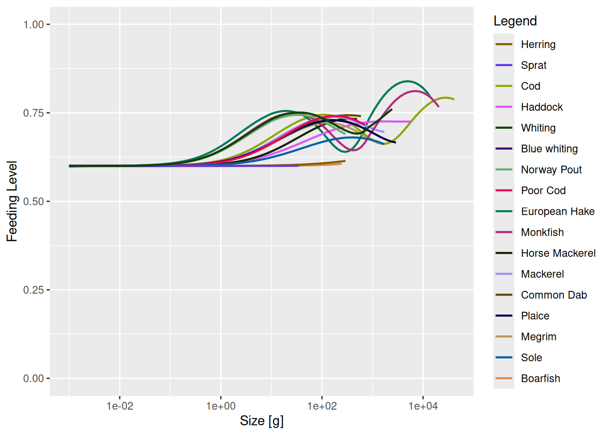
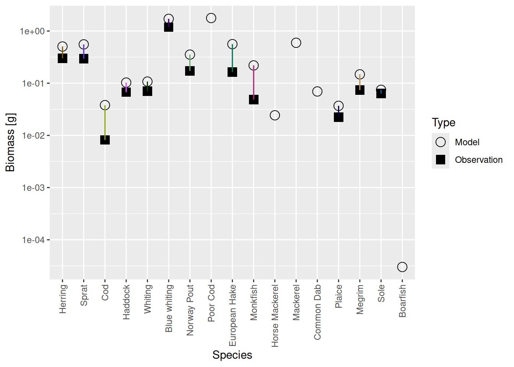
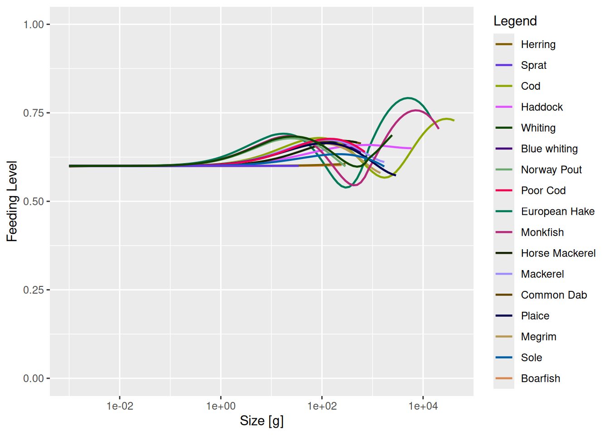

# Refine your model

## Introduction

In this tutorial we will start to refine the mizer model that we created in the [previous tutorial](../build/create-first-model.llms.md). That model already has the broad features correct: In all the species we decided to include are coexisting in a steady state with the desired biomasses and growth rates. Mizer itself determined the size distribution of the species. We did not need to specify many parameters to achieve that. For most of the parameters that we did supply we said that it did not matter that we could only make educated guesses for their values or even just put `NA`, because we could refine the model later. We will start this refinement process in this tutorial and continue it in the next.

``` downlit
library(mizer)
library(mizerExperimental)
library(tidyverse)
```

We load the model we created in the [previous tutorial](../build/create-first-model.llms.md).

``` downlit
cel_model <- readParams("cel_model.rds")
```

## Resource abundance

One bit of information that we did not supply when we set up the model was the abundance of the resource. Let us take a look at the size-spectrum plot to see what value mizer chose:

``` downlit
plotlySpectra(cel_model, power = 2, total = TRUE)
```

We have put `total = TRUE` to include the total community spectrum in the plot in black. At the smallest sizes the community is comprised of the resource only, plotted in green, but then at larger sizes the fish contribute. Sheldon’s observation was that the community size spectrum would be approximately flat all the way from bacteria to whales. We notice that the above plot does not quite conform to that observation. Instead, the spectrum is quite a bit lower at small sizes, then rises at the sizes where the fish dominate. It then drops off again because we have not included anything larger than cod in our model. No whales here. To get a community spectrum more in line with Sheldon’s observation we should increase the resource abundance

There is another plot that shows us that our model currently has too little resource. We plot the feeding level:

``` downlit
plotFeedingLevel(cel_model)
```



Recall from the [section on the feeding level](../understand/predation-growth-and-mortality.llms.md#feeding-level) in Part 1 of the course that the feeding level is the ratio between the actual intake rate and the maximum intake rate, so can never exceed 1. The closer it is to 1 the more satiated the fish is and the less of the encountered prey it will consume. The reason the feeding levels in the above plot is higher at larger sizes than at smaller sizes is that at larger sizes the fish start feeding on other fish while at smaller sizes they have to rely on the resource, and the resource is not as abundant as it should be.

We will now want to increase the abundance of resource, both to get the community abundance more in line with Sheldon’s observation and to give the fish a more constant feeding level throughout their life. We will first start doing this the tedious way in code and then introduce the [`tuneParams()`](https://sizespectrum.org/mizerExperimental/reference/tuneParams.html) shiny gadget to do it with point and click.

### Code

We don’t know by exactly what factor we need to scale up the resource. Let’s try increasing it by a factor of 2:

``` downlit
cel_model <- scaleDownBackground(cel_model, factor = 1/2)
```

That the function scales down rather than up, so that we need to set the scaling factor to 1/2 rather than 2, is a historical accident. Let’s look at the spectrum plot now:

``` downlit
plotlySpectra(cel_model, power = 2, total = TRUE)
```

The resource has increased by a factor of 2, even if this is not very noticeable on this logarithmic y axis. But we are now no longer in steady state. As always after we have made a modification, we need to run the dynamics to get back to steady state. But before we do that, we also want to match the growth rates again because they will of course have increased by increasing the resource abundance. So we do

``` downlit
cel_model <- cel_model |> matchGrowth() |> steady()
```

This has now messed up the biomasses in the model:

``` downlit
plotBiomassVsSpecies(cel_model)
```



So we also do

``` downlit
cel_model <- cel_model |> matchBiomasses() |> steady()
```

This is what the feeding levels look like now:

``` downlit
plotFeedingLevel(cel_model)
```



A little bit better but clearly not enough. So we need to do it again. But you will already have gotten the sense that this is going to be tedious: making the change, running to steady state, plotting the result, trying again ….

### Shiny gadget

We will now introduce a shiny gadget (that is \[a technical term\] (https://shiny.rstudio.com/articles/gadgets.html)) that greatly facilitates this iterative tuning of the model. The gadget allows quick experimentation with changes to model parameters. It provides sliders for adjusting model parameters and tabs with various plots to immediately see the result of the changes. You can choose which parameter sliders and which plot tabs to include.

We start the gadget by calling the [`tuneParams()`](https://sizespectrum.org/mizerExperimental/reference/tuneParams.html) function.

``` downlit
cel_model <- tuneParams(cel_model)
```

This will open the gadget in your web browser with our current model `cel_model` loaded. The following video shows what we do on that web page. After making the changes we want to make, we click the “Return” button in the gadget and the [`tuneParams()`](https://sizespectrum.org/mizerExperimental/reference/tuneParams.html) function returns the model in that updated state. The above code then assigns that updated model to the variable `cel_model`.

# An error occurred.

Unable to execute JavaScript.

Now feel free to experiment with the [`tuneParams()`](https://sizespectrum.org/mizerExperimental/reference/tuneParams.html) gadget a bit. We will however also use it together in the next tutorial to match observed landings.

When you are done, save your model for use in the next tutorial:

``` downlit
saveParams(cel_model, "cel_model_refined.rds")
```
