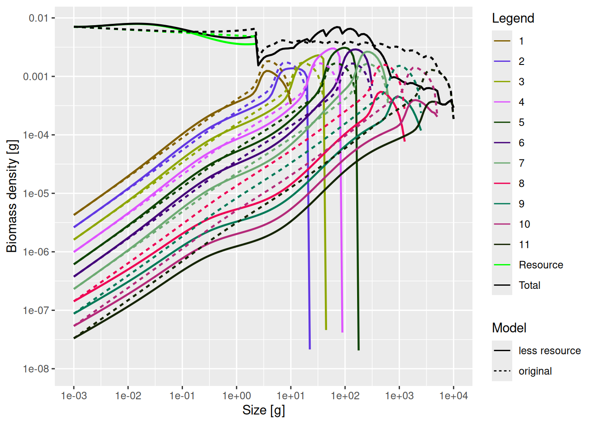
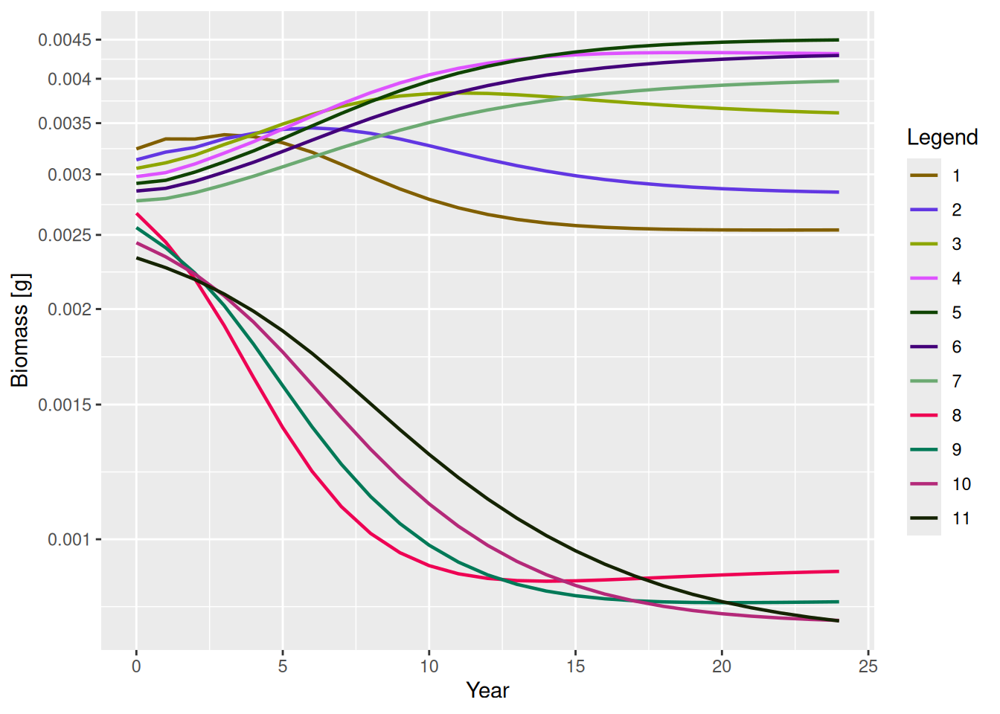
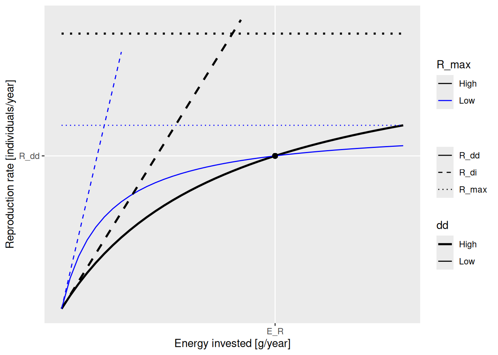
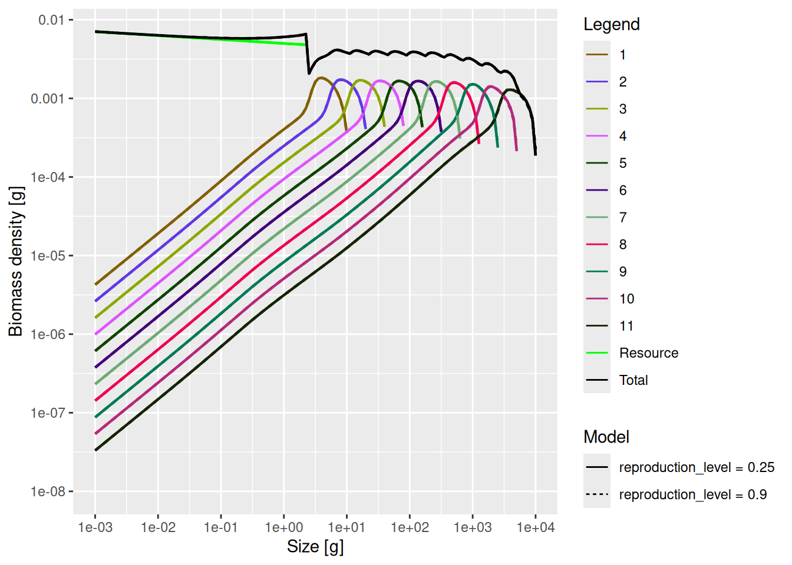

# Dynamics of size spectra

## Size spectrum dynamics

In previous tutorials we have concentrated on the steady state of the mizer model, where for each size class and each species, the rate at which individuals grow into the size class balances the rate at which individuals grow out of the size class or die, thus keeping the size spectrum constant. In this tutorial we explore the dynamic that takes place when this balance is changed.

Size-spectrum dynamics is described by the beautiful partial differential equation

\frac{\partial N(w)}{\partial t} + \frac{\partial g(w) N(w)}{\partial w} = -\mu(w) N(w)

together with the boundary condition

N(w\_{min}) = \frac{R\_{dd}}{g(w\_{min})},

where N(w) is the number density at size w, g(w) is the growth rate and \mu(w) is the death rate of individuals of size w, w\_{min} is the egg size and R\_{dd} is the birth rate. Luckily it is easy to describe in words what these equations are saying.

> **IMPORTANT:**
>
> Size spectrum dynamics is very intuitive: The rate at which the number of individuals in a size class changes is the difference between the rate at which individuals are entering the size class and the rate at which they are leaving the size class. Individuals can enter a size class by growing in or, in the case of the smallest size class, by being born into it. They can leave by growing out or by dying.

What makes these seemingly obvious dynamics interesting is how the growth rate and the death rate are determined in terms of the abundance of prey and predators and the feeding preferences and physiological parameters of the individuals. We have discussed a bit of that in previous tutorials and will discuss it much more in upcoming tutorials. We will discuss the birth rate R\_{dd} below in the section on [how reproduction is modelled](dynamics-of-spectra.llms.md#how-reproduction-is-modelled). But first we want to look at the results of simulating the size spectrum dynamics.

``` downlit
library(mizer)
library(mizerExperimental)
library(tidyverse)
```

### Projections

In the previous tutorial, in the section on [trophic cascades](../understand/species-interactions.llms.md#trophic-cascades), we already simulated the size-spectrum dynamics to find the new steady state. But we only looked at the final outcome once the dynamics had settled down to the new steady state. We reproduce the code here:

``` downlit
# Create trait-based model
mp <- newTraitParams() |> 
    # run to steady state with constant reproduction rate
    tuneSteadyState() |>
    # turn of reproduction and instead keep egg abundance constant
    setRateFunction("RDI", "constantEggRDI") |>
    setRateFunction("RDD", "noRDD")

# We make a copy of the model
mp_lessRes <- mp
# and set the resource interaction to 0.8 for species 8 to 11
given_species_params(mp_lessRes)$interaction_resource[8:11] <- 0.8

# We run the dynamics until we reach steady state
mp_lessRes_steady <- projectToSteady(mp_lessRes)

# We compare the steady states
plotSpectra2(mp_lessRes_steady, name1 = "less resource", 
             mp, name2 = "original",
             total = TRUE, biomass = TRUE, per_log_size = TRUE,
             ylim = c(1e-8, NA), wlim = c(1e-3, NA))
```



But we can also save and then display the spectra of all the species at intermediate times. This is what the [`project()`](https://sizespectrum.org/mizer/reference/project.html) function does. It projects the current state forward in time and saves the result of that simulation in a larger object, a MizerSim object, which contains the resulting time series of size spectra. Let’s use it to project forward by 24 years.

``` downlit
sim_lessRes <- project(mp_lessRes, t_max = 24)
```

We can now use this MizerSim object in the [`animateSpectra()`](https://sizespectrum.org/mizer/reference/animate.html) function to create an animation showing the change in the size spectra over time.

``` downlit
animateSpectra(sim_lessRes, total = TRUE, biomass = TRUE, per_log_size = TRUE, 
               ylim = c(1e-8, NA), wlim = c(1e-3, NA))
```

Go ahead, press the Play button.

**Note**, for some species size spectra at the largest size class drop all the way to very small values (e.g. 10^-7) and for others they stop higher. This is just a discretisation artefact and is not important. Try to ignore it.

Of course we can also get at the numeric values of the spectra at different times. First of all the function [`getTimes()`](https://sizespectrum.org/mizer/reference/getTimes.html) gives the times at which simulation results are available in the MizerSim object:

``` downlit
getTimes(sim_lessRes)
```

     [1]  0  1  2  3  4  5  6  7  8  9 10 11 12 13 14 15 16 17 18 19 20 21 22 23 24

The simulation results have been saved at yearly intervals. We could have changed that via the `t_save` argument to [`project()`](https://sizespectrum.org/mizer/reference/project.html).

The function [`N()`](https://sizespectrum.org/mizer/reference/N.html) returns a three-dimensional array (time x species x size) with the number density of consumers. To get for example the number density for the 2nd species after 5 years in the 1st size class we do

``` downlit
N(sim_lessRes)[6, 2, 1]
```

    [1] 2.621407

The function [`getBiomass()`](https://sizespectrum.org/mizer/reference/getBiomass.html) acting on a MizerSim object returns an array (time x species) containing the total biomass in grams at each time step for each species. So for example the biomass in grams of the 2nd species after 5 years is

``` downlit
getBiomass(sim_lessRes)[6, 2]
```

    [1] 0.003434511

The biomass time series can be plotted with [`plotBiomass()`](https://sizespectrum.org/mizer/reference/plotBiomass.html):

``` downlit
plotBiomass(sim_lessRes)
```



Mizer provides many more functions to analyse the results of a simulation, some of which you will learn about later in this course.

## Reproduction dynamics

The above simulation was run with constant abundance in the smallest size class for each species. This of course is not realistic. The abundance of the smallest individuals depends on the rate at which mature individuals spawn offspring, and this in turn depends, among other things, on the abundance of mature individuals. So if the abundance of mature individuals goes down drastically, as it did for species 8 to 11 above, then the abundance of offsprings for those species will go down as well.

To see the effect we run the same code as above after deleting the two lines that turned off the reproduction dynamics. We also specify with `t_save = 2` that we want to save the spectrum only every second year, which speeds up the display of the animation.

``` downlit
# Create trait-based model and run to steady state
mp <- newTraitParams() |> tuneSteadyState()

# We make a copy of the model
mp_lessRes <- mp
# and set the resource interaction to 0.8 for species 8 to 11
given_species_params(mp_lessRes)$interaction_resource[8:11] <- 0.8

# We simulate the dynamics for 30 years, saving only every 2nd year
sim_lessRes <- project(mp_lessRes, t_max = 30, t_save = 2)

# We animate the result
animateSpectra(sim_lessRes, total = TRUE, biomass = TRUE, per_log_size = TRUE, 
               ylim = c(1e-8, NA), wlim = c(1e-3, NA))
```

Note that now the fish species whose access to resources was decreased continue to decrease in abundance as time goes on. Interestingly, species 1 appears to be driven to extinction by the increased abundance of its predators that in turn is due to the decrease in predation from the larger species.

Given that reproduction has such an important impact on the response of species to fishing, it is worth taking a look at how reproduction is modelled in mizer.

### Energy invested into reproduction

We already discussed the [investment into reproduction](single-species-spectra.llms.md#investment-into-reproduction) in an earlier tutorial. As mature individuals grow, they invest an increasing proportion of their income into reproduction and at their asymptotic size they would be investing all income into reproduction. Summing up all these investments from mature individuals of a particular species gives the total rate E_R at which that species invests energy into reproduction. This total rate of investment is multiplied by a reproduction efficiency factor `erepro`, divided by a factor of 2 to take into account that only females reproduce, and then divided by the egg weight `w_min` to convert it into the rate at which eggs are produced. The equation is:

R\_{di} = \frac{\text{erepro}}{2 w\_{min}} E_R.

This is calculated in mizer with [`getRDI()`](https://sizespectrum.org/mizer/reference/getRDI.html):

``` downlit
getRDI(mp)
```

              1           2           3           4           5           6 
    0.344090412 0.211705188 0.130253809 0.080140004 0.049306967 0.030336622 
              7           8           9          10          11 
    0.018664921 0.011483786 0.007065518 0.004347133 0.002674619 

The `erepro` parameter or reproduction efficiency can vary between 0 and 1 (although 0 would be bad) and gives the proportion of energy invested into reproduction that is converted into viable eggs or larvae.

### Density-dependence in reproduction

Note that mizer models the rate of egg production. The size spectrum dynamics then determine how many of those larvae grow up and survive to be recruited to the fishery.

> **IMPORTANT:**
>
> The stock-recruitment relationship is an emergent phenomenon in mizer, with several sources of density dependence. Firstly, the amount of energy invested into reproduction depends on the energy income of the spawners, which is density-dependent due to competition for prey. Secondly, the proportion of larvae that grow up to recruitment size depends on the larval mortality, which depends on the density of predators, and on larval growth rate, which depends on density of prey.

However, there are other sources of density dependence that are not explicitly modelled mechanistically in mizer. An example would be a limited carrying capacity of suitable spawning grounds and other spatial effects. So mizer has another species parameter R\_{max} that gives the maximum possible rate of recruitment. Imposing a finite maximum reproduction rate leads to a non-linear relationship between energy invested and eggs hatched. This density-dependent reproduction rate R\_{dd} is given by a Beverton-Holt type function:

R\_{dd} = R\_{di} \frac{R\_{max}}{R\_{di} + R\_{max}}

Rather than looking at the formula, let’s look at a figure:

    Warning in geom_point(aes(x = 50/4, y = 5/6), size = 2): All aesthetics have length 1, but the data has 194 rows.
    ℹ Please consider using `annotate()` or provide this layer with data containing
      a single row.

    Ignoring unknown labels:
    • size : "R_max"



This figure shows two graphs of R\_{dd} (solid lines), one for higher R\_{max} (black) and one for lower R\_{max} (blue). The values of R\_{max} are indicated by the dotted lines. The dashed lines show the density-independent rate R\_{di}. Both graphs are for the same amount E_R of energy invested into reproduction.

The important fact to observe is that the solid curves becomes more shallow as R\_{max} gets closer to the actual reproduction rate R\_{dd}. This slope determines how big the effect of a change in investment into reproduction (for example due to a change in spawning stock biomass) is on the reproduction rate. As the energy invested in reproduction changes away from the steady state value E_R on the x-axis, the the solid curves shows how much the reproduction rate changes on the y-axis. The change is smaller along the shallower blue line, the one that corresponds to the R\_{max} value that is closer to R\_{dd}. The result is that a species with a low ratio between R\_{max} and R\_{dd} will be less impacted by depletion of its spawning stock by fishing, for example. This ratio we will refer to as the **reproduction level** and we will discuss it in the next section.

This density-dependent rate of reproduction is calculated in mizer with [`getRDD()`](https://sizespectrum.org/mizer/reference/getRDD.html):

``` downlit
getRDD(mp)
```

              1           2           3           4           5           6 
    0.258067809 0.158778891 0.097690357 0.060105003 0.036980226 0.022752467 
              7           8           9          10          11 
    0.013998691 0.008612839 0.005299139 0.003260350 0.002005964 

This is the rate at which new individuals are entering the smallest size class. The actual number density in the smallest size class is then determined by the usual size-spectrum dynamics.

### Reproduction level

We have seen the two species parameters that determine how the energy invested into reproduction is converted to the number of eggs produced: `erepro` and `R_max`. For neither of these is it obvious what value they should have. The choice of values influences two important properties of a model: the steady state abundances of the species and the density-dependence in reproduction. It is therefore useful to change to a new set of two parameters that reflect these two properties better. These are:

- The birth rate R\_{dd} at steady state. This determines the abundance of a species.

- The ratio between R\_{dd} and R\_{max} at steady state. This determines the degree of density dependence.

The ratio R\_{dd} / R\_{max} we denote as the **reproduction level**. This name may remind you of the feeding level, which was the ratio between the actual feeding rate and the maximum feeding rate and described the level of density dependence coming from satiation. It takes a value between 0 and 1. It follows from our discussion in the previous section that a species with a high reproduction level is more resilient to changes.

We can get the reproduction levels of the different species with [`reproduction_level()`](https://sizespectrum.org/mizer/reference/setBevertonHolt.html):

``` downlit
reproduction_level(mp)
```

       1    2    3    4    5    6    7    8    9   10   11 
    0.25 0.25 0.25 0.25 0.25 0.25 0.25 0.25 0.25 0.25 0.25 

We see that by default [`newTraitParams()`](https://sizespectrum.org/mizer/reference/newTraitParams.html) had given all species the same reproduction level. We can change the reproduction level with the [`setBevertonHolt()`](https://sizespectrum.org/mizer/reference/setBevertonHolt.html) function. We can set different reproduction levels for each species, but here we will simply set it to 0.9 for all species:

``` downlit
mp9 <- setBevertonHolt(mp, reproduction_level = 0.9)
```

Changing the reproduction level has no effect on the steady state, because that only depends on the rate of egg production R\_{dd} and that is kept fixed when changing the reproduction level. We can check that by running our new model to steady state and plotting that steady state together with the original steady state.

``` downlit
mp9 <- projectToSteady(mp9)
```

    Reached the convergence tolerance after 3 years. The biomasses change at up to
    0.0015 per year.

``` downlit
plotSpectra2(mp, name1 = "reproduction_level = 0.25",
             mp9, name2 = "reproduction_level = 0.9",
             total = TRUE, biomass = TRUE, per_log_size = TRUE,
             ylim = c(1e-8, NA), wlim = c(1e-3, NA))
```



They overlap perfectly. However the reproduction level does have an effect on how sensitive the system is to changes. As an example, let us look at the dynamics that is triggered by the reduction in interaction with the resource by species 8 through 11.

``` downlit
# We make a copy of the model
mp_lessRes9 <- mp9
# and set the resource interaction to 0.8 for species 8 to 11
given_species_params(mp_lessRes9)$interaction_resource[8:11] <- 0.8

sim_lessRes9 <- project(mp_lessRes9, t_max = 30, t_save = 2)

animateSpectra(sim_lessRes9, total = TRUE, biomass = TRUE, per_log_size = TRUE, 
               ylim = c(1e-8, NA), wlim = c(1e-3, NA))
```

Notice how the species have settled down to a new steady state after 30 years without any extinctions and the impact on species 1 is much less extreme. As expected, the higher reproduction level has made the species more resilient to perturbations.

The problem of course is that in practice the reproduction level is hardly ever known. Instead, one will need to use any information one has about the sensitivity of the system from observed past perturbations to calibrate the reproduction levels. We’ll discuss this again towards the end of Part 2.

> **CAUTION:**
>
> Go back to the example with fishing on individuals above 1kg from the section on [fishing-induced cascades](species-interactions.llms.md#fishing-induced-cascades). Impose the same fishing, but now on the trait-based model with reproduction dynamics left turned on and with a reproduction level of 0.5 for all species. Project the model for 20 years and animate the result.
>
> > **CAUTION:**
> >
> > ``` downlit
> > # We make a copy of the trait-based model
> > mp_fishing <- mp
> > # Set the reproduction level set to 0.5 for all species
> > mp_fishing <- setBevertonHolt(mp, reproduction_level = 0.5)
> > # Set fishing effort to 1
> > initial_effort(mp_fishing) <- 1
> >
> > # Simulate the dynamics for 20 years
> > sim_fishing <- project(mp_fishing, t_max = 20, t_save = 2)
> >
> > # Animate the result
> > animateSpectra(sim_fishing, total = TRUE, biomass = TRUE, per_log_size = TRUE, 
> >                ylim = c(1e-8, NA), wlim = c(1e-3, NA))
> > ```

## Resource dynamics

The resource spectrum is not described by size spectrum dynamics, because in reality it is typically not made up of individuals that grow over a large size range during their life time. In mizer, the resource number density in each size class is describe by semichemostat dynamics: the resource number density in each size class recovers after depletion, and this biomass growth or recovery rate will decrease as the number density gets close to a carrying capacity. If you want the mathematical details, you can find them in the [mizer model description](https://sizespectrum.org/mizer/articles/model_description.html) in the section on [resource density](https://sizespectrum.org/mizer/articles/model_description.html#resource-density).

The effect of these dynamics is that if the number of fish consuming the resource in a certain size range increases, the resource abundance in that size range will decrease, if it cannot recover quickly enough (regeneration rate of the resource is set by the user). So there is competition for the resource, which provides a stabilising influence on the fish abundances. We will be discussing this more in later tutorials.

## Summary and recap

1\) Size spectrum dynamics is very intuitive: the rate at which the number of individuals in a size class changes is the difference between the rate at which individuals grow into (or are born into) the size class and the rate at which individuals grow out of or the size class or die in the size class.

2\) The [`project()`](https://sizespectrum.org/mizer/reference/project.html) function simulates the dynamics and creates a MizerSim object that contains the resulting time series of size spectra.

3\) Mizer provides many functions for extracting, analysing and plotting the results of a simulation, some of which we will be using in Part 3.

4\) Instead of a stock-recruitment relationship as used in other fisheries models, a mizer model relates the energy invested into reproduction to the number of eggs produced. The growth and mortality that the larvae experience until they are recruited to the fishery lead to density-dependence in the recruitment. Additional density dependence is applied to the egg production.

5\) The relation between energy invested in reproduction and the actual birth rate is described by two parameters: the density independent reproduction efficiency `erepro` and the maximum birth rate `R_max`.

6\) In practice a more useful way to parametrise the reproduction is by two other parameters: the birth rate R\_{dd} at steady state (which determines the total abundance of a species) and the *reproduction level* (which determines the amount the amount of density dependence that applies to egg production).

7\) A change in the reproduction level does not change the steady state but it changes the sensitivity of a species and the system to changes.

8\) The resource abundance is also dynamic and thus decreases when there is increased consumption, which has a stabilising effect on the fish community.

## Recap of Part 1

Congratulations. You have reached the end of Part 1 of the mizer course.

You have learned to understand plots of size spectra and how the size-spectra are shaped by the interplay between growth and mortality. You have seen that both growth and mortality are emergent effects in mizer, both being caused by predation and thus dependent on the abundance of predator and prey. You appreciate that size-spectrum dynamics is very different from usual predator-prey dynamics, because the abundance of prey affects the growth rate of the predator rather than its abundance. You have seen the interesting trophic cascades that result from the size-based interaction between predator and prey. Finally you learned that stock-recruitment relationships are also emergent phenomena in mizer.

This was a lot to take in. You will probably want to come back to some of these ideas while you learn how to build mizer models in Part 2 of the course.
