# Single species spectra

## Introduction

At the end of the previous tutorial we plotted single-species size spectra from our dataset and observed that they were a bit of a mess. In this tutorial we will use the mizer model to gain an understanding of what determines the shape of a species size spectrum.

In this tutorial you are also going to start using mizer functions. When you want to learn more about any of the functions that we use in the examples, simply click on the function name. This will open the function’s help page in a new browser window.

First, load some required packages with the following commands:

``` downlit
library(mizer)
library(mizerExperimental)
library(tidyverse)
```

## Single-species model

In this and the next tutorial we want to keep the size-spectrum aspects of the mizer model separate from the multi-species aspects, so that we do not have to think about too many things at once. So we will explore a model where a single species lives in a non-dynamical background community that we will set to a Sheldon power-law abundance. Only in the fourth tutorial, exploring [species interactions](../understand/species-interactions.llms.md), will we start to consider the interesting multi-species phenomena that arise in mizer models.

In this tutorial we will only be interested in the shape of the size spectrum, i.e., in how the total number of individuals is distributed over the different sizes. We are not yet interested in the overall abundance of the species. The overall abundance would be influenced by the total rate of reproduction and recruitment for the species. This in turn would be influenced by the size spectrum, because that determines how many of the individuals are mature. This dynamic feedback will of course become important when we build real-world models in Part 2 and use them in Part 3. But for now we have enough on our plate without thinking also about this.

Mizer collects all the parameters describing a size-spectrum model into one object of class `MizerParams`. You do not need to set up this object by hand because there are several wrapper functions in mizer that create the object for you for various types of models, and also many functions for changing specific parameters in a model. We will use the [`newSingleSpeciesParams()`](https://sizespectrum.org/mizer/reference/newSingleSpeciesParams.html) function to set up a model describing a single fish species living in an ecosystem whose community size spectrum is given by a power-law.

The [`newSingleSpeciesParams()`](https://sizespectrum.org/mizer/reference/newSingleSpeciesParams.html) function has many arguments that allow you to specify parameters for the fish species as well as for the community, but all these arguments have default values, so we can simply call the function without specifying those arguments. We will only specify the power-law exponent `lambda` of the background community. Note that in mizer the size spectrum exponent refers to the number density and is therefore expected to be around 2.

``` downlit
params <- newSingleSpeciesParams(lambda = 2.05)
```

The function returns a `MizerParams` object and we have assigned that to the variable `params`. We will be explaining more about this model as we go along.

## Steady state spectrum

As a final simplification in this and the next two tutorials, we will only consider the steady state size spectra. The steady state is the state where in each size class the inflow of individuals through growth exactly balances the outflow of individuals through growth and death. This means that the size spectrum is in equilibrium. The initial size spectrum of the species in the `params` object that we created with [`newSingleSpeciesParams()`](https://sizespectrum.org/mizer/reference/newSingleSpeciesParams.html) has already been set to the steady state size spectrum.

We can plot the size spectrum with the [`plotSpectra()`](https://sizespectrum.org/mizer/reference/plotSpectra.html) function.

``` downlit
plotSpectra(params, power = 0)
```

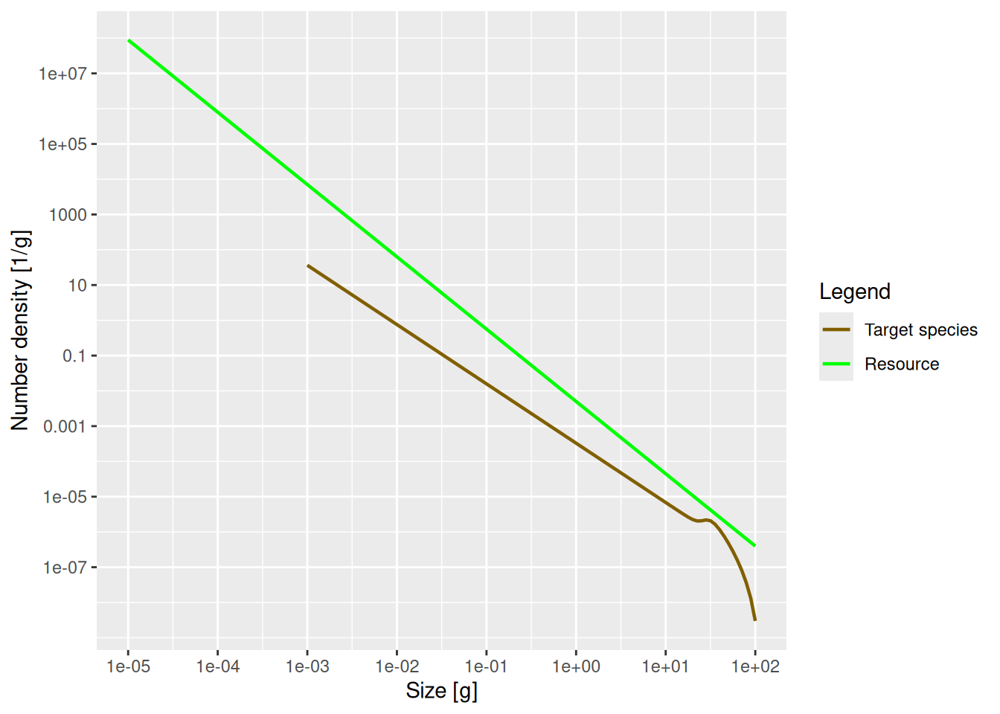

The `power = 0` argument to the [`plotSpectra()`](https://sizespectrum.org/mizer/reference/plotSpectra.html) function specifies that we want to plot the number density, rather than for example the biomass density. We’ll discuss this more below in the section on [other representations](#other-representations).

The green line represents the number density of the background community, labelled as “Resource” in the plot legend, in which our foreground species finds itself. The green line is a straight line with slope `lambda = -2.05`. Thus the number density of the background community is proportional to w^{-2.05}. It is important to understand that a power-law curve looks like a straight line when plotted on logarithmic axes and the slope of the line is the exponent in the power law. If this does not sound familiar, please revisit the section in the previous tutorial where we [fitted a power-law](observed-size-spectra.qmdfitting-a-power-law) to the community spectrum.

The other line represents the number density of our single species, which by default is just named unimaginatively “Target species”. We see that it is a straight line initially, but then has a bump before declining rapidly at large sizes. We will discuss in a short while what causes that shape.

Remember what these size spectra plots indicate. They show the number density of individuals as a function of size. The initial slope of the target species’ number density is negative, which vaguely means that there are fewer larger fish than smaller fish. That is of course understandable: lots of fish die while they are growing up, so there tend to be fewer fish in larger size classes.

It is now time to do the first exercise of this tutorial.

> **CAUTION:**
>
> Create a MizerParams object describing a single species in a power-law background where the Sheldon exponent is 2.1. Then plot the number density as a function of weight.
>
> > **CAUTION:**
> >
> > ``` downlit
> > params21 <- newSingleSpeciesParams(lambda = 2.1)
> > plot21 <- plotSpectra(params21, power = 0)
> > plot21
> > ```
> >
> > 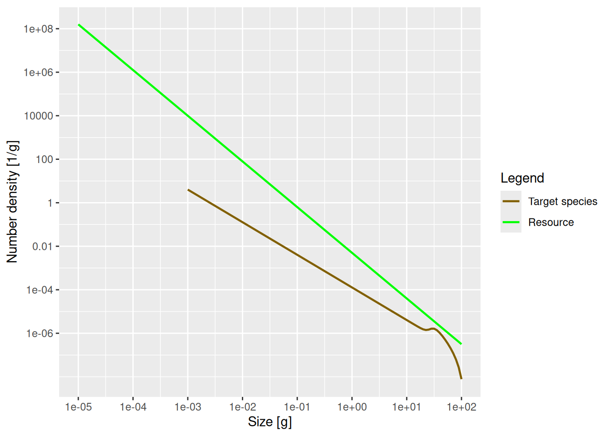

## Numbers

While the [`plotSpectra()`](https://sizespectrum.org/mizer/reference/plotSpectra.html) function gives us a plot of the number density, it would be nice if we could get at the actual numerical values. We can access them with the [`initialN()`](https://sizespectrum.org/mizer/reference/initialN-set.html) function. Let us assign this to a variable `n`:

``` downlit
n <- initialN(params)
```

As you can see in the “Environment” pane in RStudio, `n` is an array of class ‘ArraySpeciesBySize’ with 1 row and 101 columns.

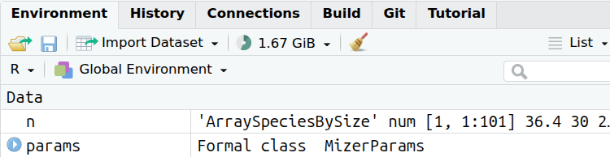

The one row corresponds to the one species. In a multispecies model there would be one row for each species, holding the number density for that species. The 101 columns are for the number densities in each of the 101 size classes. By default mizer uses 100+1 size clases (or size bins), although you can easily change that. In fact, `n` is a named array, i.e., each row and each column has names. These we can extract with the [`dimnames()`](https://rdrr.io/r/base/dimnames.html) function.

``` downlit
dimnames(n)
```

    $sp
    [1] "Target species"

    $w
      [1] "0.001"   "0.00112" "0.00126" "0.00141" "0.00158" "0.00178" "0.002"  
      [8] "0.00224" "0.00251" "0.00282" "0.00316" "0.00355" "0.00398" "0.00447"
     [15] "0.00501" "0.00562" "0.00631" "0.00708" "0.00794" "0.00891" "0.01"   
     [22] "0.0112"  "0.0126"  "0.0141"  "0.0158"  "0.0178"  "0.02"    "0.0224" 
     [29] "0.0251"  "0.0282"  "0.0316"  "0.0355"  "0.0398"  "0.0447"  "0.0501" 
     [36] "0.0562"  "0.0631"  "0.0708"  "0.0794"  "0.0891"  "0.1"     "0.112"  
     [43] "0.126"   "0.141"   "0.158"   "0.178"   "0.2"     "0.224"   "0.251"  
     [50] "0.282"   "0.316"   "0.355"   "0.398"   "0.447"   "0.501"   "0.562"  
     [57] "0.631"   "0.708"   "0.794"   "0.891"   "1"       "1.12"    "1.26"   
     [64] "1.41"    "1.58"    "1.78"    "2"       "2.24"    "2.51"    "2.82"   
     [71] "3.16"    "3.55"    "3.98"    "4.47"    "5.01"    "5.62"    "6.31"   
     [78] "7.08"    "7.94"    "8.91"    "10"      "11.2"    "12.6"    "14.1"   
     [85] "15.8"    "17.8"    "20"      "22.4"    "25.1"    "28.2"    "31.6"   
     [92] "35.5"    "39.8"    "44.7"    "50.1"    "56.2"    "63.1"    "70.8"   
     [99] "79.4"    "89.1"    "100"    

The names of the columns are the weight in grams at the start of each size class. Notice how R displays long vectors by breaking them across many lines and starting each line with a number in brackets. That number is the index of the first value in that row. So for example we see that the 61st size class starts at 1 gram. The number density in the size class between 1 gram and 1.12 grams (the start of the next size class) is

``` downlit
n[1, 61]
```

    [1] 0.0003282314

It is important to realise that this is not the number of fish in the size class, but the average number density in the size class. To get the number of fish we have to multiply the number density by the width of the size class. Those widths can be obtained with the [`dw()`](https://sizespectrum.org/mizer/reference/w.html) function. So the number of fish in each size class is obtained with

``` downlit
numbers <- n * dw(params)
```

The number of individuals in the size class between 1 gram and 1.12 grams is

``` downlit
numbers[1, 61]
```

    [1] 4.005029e-05

You may be surprised by the small number if you interpret it as the number of fish between 1 gram and 1.12 gram in the entire ocean. However it looks more reasonable if it is the average number per square meter of sea. For more of a discussion of this issue of working with numbers per area, numbers per volume or numbers for the entire system see <https://sizespectrum.org/mizer/reference/setParams.html#units-in-mizer>

> **CAUTION:**
>
> Determine the total number of fish in the model with sizes between 10 grams and 20 grams. You can use the [`sum()`](https://rdrr.io/r/base/sum.html) function to add together contributions from the various size classes.
>
> > **CAUTION:**
> >
> > You have seen above how you can get the numbers in a single size bin. To get the numbers in each of a range of size bins you can use syntax like
> >
> > ``` downlit
> > numbers[1, 61:65]
> > ```
> >
> >                1         1.12         1.26         1.41         1.58 
> >     4.005029e-05 3.702779e-05 3.423339e-05 3.164987e-05 2.926133e-05 
> >
> > You can pass a vector of numbers like this to the [`sum()`](https://rdrr.io/r/base/sum.html) function to add the numbers together.
>
> > **CAUTION:**
> >
> > The size bins covering the range from 10 to 20 grams are the bins 81 to 86 inclusive.
> >
> > ``` downlit
> > sum(numbers[1, 81:86])
> > ```
> >
> >     [1] 4.163148e-05

## Other representations

We have seen in the previous tutorial on [observed size spectra](../understand/observed-size-spectra.llms.md) that the size spectrum can be represented in various ways. Besides the number density N(w) we introduced the biomass density B(w), the number density in log weight N\_{\log}(w) and the biomass density in log weight B\_{\log}(w). These were related to each other by multiplication by different powers of w:

B(w) = N\_{\log}(w) = w N(w) \text{ and } B\_{\log}(w) = w^2 N(w).

We can use the `power` argument of the [`plotSpectra()`](https://sizespectrum.org/mizer/reference/plotSpectra.html) function to determine which of these densities to plot. Above we plotted the number density by setting `power = 0`. Without the `power` argument (or with `power = 1` which is the default) the [`plotSpectra()`](https://sizespectrum.org/mizer/reference/plotSpectra.html) function plots the biomass density as a function of weight, which is also the number density as a function of log weight:

``` downlit
plotSpectra(params)
```

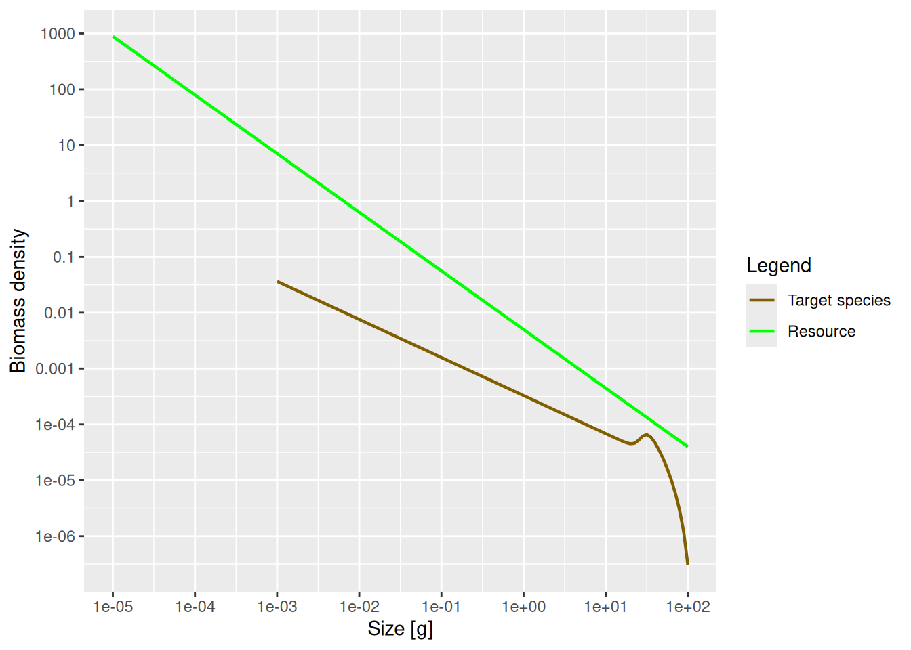

Now the green line representing the biomass density of the background has a slope of -1.05. The initial slope of the species biomass density is also negative, meaning that the biomass density in the species decreases with size.

We can also plot the biomass density in log weight, i.e., the Sheldon spectrum, by supplying the argument `power = 2` to [`plotSpectra()`](https://sizespectrum.org/mizer/reference/plotSpectra.html).

``` downlit
plotSpectra(params, power = 2)
```

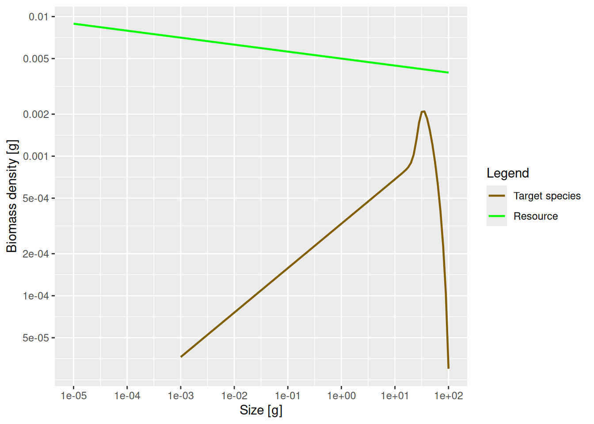

This now shows an approximately constant background biomass density in log weight (the slope of the green line is -0.05). The biomass density of the species in log size initially increases. So if binned in logarithmically-sized bins the biomass in each bin will initially increase, until it starts decreasing close to the maximum size of the species.

This latest plot seems to indicate that most of the biomass of the species is concentrated at larger sizes of around 30 grams, whereas the previous plot seemed to indicate that most of the biomass is at the smallest sizes. So which one is true? Please think about this question, because it really highlights the importance of not confusing biomass density with biomass. Questions about the amount of biomass **at a size** do not make sense. Instead you have to ask about biomass **in a size range**.

So for example, we might want to consider the prey biomass available to two different predators of our species, one small and one large. Assume that the smaller predator feeds on prey in the size range from 1g to 2g. The other predator, which we assume is 10 times larger, feeds on prey in the size range from 10g to 20g. These feeding intervals have the same width on the logarithmic weight axis. Therefore we should look at the plot of the biomass density in log weight to see that the larger predator has a lot more prey biomass from our species available to it than the smaller one. This is in spite of the fact that the plot of biomass density in weight tells us that the biomass density is lower at 10g than at 1g.

There is another way to represent the size distribution. When we talk about size spectra, we always have the representation in terms of densities in mind. You may already be familiar with the concept of a densities from probability theory, where you can describe a probability distribution in terms of its probability density function. But perhaps you also know that there is an alternative description of the probability distribution in terms of the cumulative distribution function (CDF). We can similarly describe the size distribution by a cumulative abundance distribution function, which gives the proportion of fish that are smaller than a given size:

``` downlit
plotCDF(params, power = 0)
```

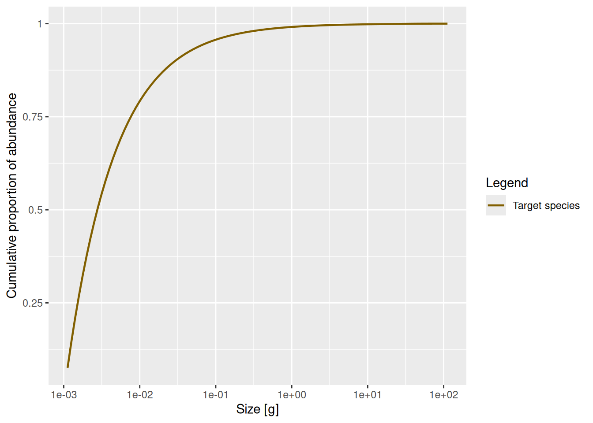

This plot shows very clearly that most fish are larvae.

It may have been a bit confusing that we displayed the same size spectrum in four different ways. But it is important to be aware of this because in the literature you will see all different conventions being used, so if you see a plot of a size spectrum you always need to ask yourself exactly which density is being shown.

## Biomass

As we did for [numbers](#numbers) above, let us also look at how to extract biomasses from the model.

We already said above that we can obtain the biomass density in a size class from the number density by multiplying the number density by the weight of the individuals in the size class. To obtain the appropriate weights, we use the function [`w()`](https://sizespectrum.org/mizer/reference/w.html) that returns the weights at the start of each size class. So we calculate

``` downlit
biomass_density <- n * w(params)
```

We obtain the total biomass in each size class by multiplying the biomass density in each size class by the width of each size class

``` downlit
biomass <- biomass_density * dw(params)
```

For example the biomass of fish between 1 gram and 1.12 grams is

``` downlit
biomass[61]
```

    [1] 4.005029e-05

We can describe the biomass distribution in terms of its cumulative distribution function, which gives the total biomass of all sizes up to a specific size:

``` downlit
plotCDF(params, log_x = FALSE)
```

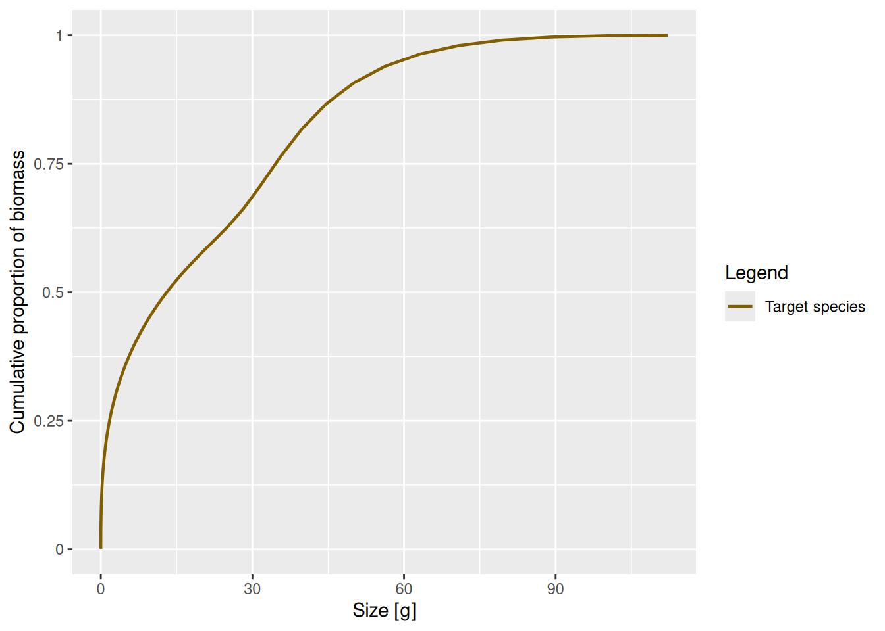

This plot shows us for example that 50% of the biomass comes from individuals that are smaller than 12.5g and individuals larger than 75g contribute very little to the total biomass. Compare that with the abundance distribution we plotted in the previous section. Almost all fish are tiny, but most of the biomass comes from large fish. So we need to always be very clear about which quantity we are considering.

We can also plot the cumulative biomass distribution function on a logarithmic weight axis:

``` downlit
plotCDF(params)
```

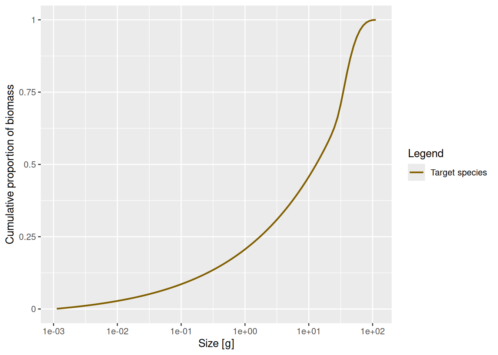

This graph contains exactly the same information as the previous graph, just showing more detail at smaller sizes and less detail at larger sizes. We can see for example that about 20% of the total biomass is from individuals smaller than 1g, which was difficult to see in the previous graph. The slope of this graph is the biomass density in log weight.

## Allometric rates

The first striking feature of the species size-spectrum, independently of which density you plot, is that for small fish (larvae and juveniles) it is given by a straight line. This is due to the allometric scaling of the physiological rates that our model is assuming and which we will discuss in this section. The other striking feature is the bulge at around maturity size, which we will discuss in the section on the [shape of the adult spectrum](#shape-of-adult-spectrum).

We will assume that the metabolic rate, i.e., the rate at which an organism expends energy on its basic metabolic needs, scales as a power of the organism’s body size, and the power is about p = 3/4.

Because this energy needs to be supplied by consumption of food, it is natural to assume that also the consumption rate scales allometrically with a power of n = 3/4. When the consumption is greater than the metabolic cost then the excess leads to growth. Hence the growth rate too scales allometrically with power 3/4.

In a multi-species mizer model the mortality is an emergent property that depends on the abundance of predators. In this single species model the mortality rate is set to the one that would emerge if all the species in the fixed background community predated with the same ferocity as the target species. This leads to a mortality rate that scale allometrically with a power of n - 1 = 3/4 - 1 = -1/4. This means that the death rate experienced by larger individuals is smaller than that of smaller individuals.

It is a result of the mathematics that if the growth and death rates scale allometrically with exponents p and n=1-p respectively, for some metabolic exponent p, that the number density at steady state is also a power law, i.e., a straight line on the log-log plot.

Let us check that in our model the physiological rates are indeed power laws, at least for the small sizes. We can get the growth rate with the [`getEGrowth()`](https://sizespectrum.org/mizer/reference/getEGrowth.html) function. We assign the result to a variable that we name `growth_rate`.

``` downlit
growth_rate <- getEGrowth(params)
```

You can again see in the “Environment” pane that this is an array with one row for the one species and 101 columns for the 101 size classes. So for example the growth rate at size 1 gram is

``` downlit
growth_rate[1, 61]
```

    [1] 4.2

(because we had seen that the 61st size class starts at 1 gram). This is the instantaneous per-capita growth rate, measured in grams per year. Note that in mizer all rates are measured in units of 1/year, but for many people daily values are easier to understand. Since growth rate here is an instantaneous rate we can simply divide it by 365 to get a daily rate (although note that mizer does not simulate processes on daily time steps). This gives us a growth rate in grams per day for a 1g sized fish of

``` downlit
growth_rate[1, 61] / 365
```

    [1] 0.01150685

We would like to make a log-log plot of the growth rate against size to check that it gives a straight line. We can do that with

``` downlit
plot(growth_rate, log_x = TRUE, log_y = TRUE)
```

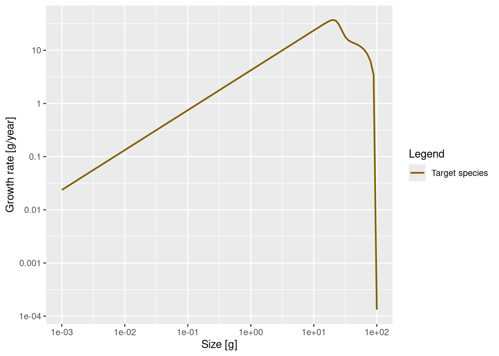

The reason `plot` knew how to label the axes and what to put in the legend is that [`getEGrowth()`](https://sizespectrum.org/mizer/reference/getEGrowth.html) returned the growth rate as an `ArraySpeciesBySize`, which has that information included as attributes.

We see that at least up to a size of a few grams the line is straight. Let’s isolate the growth rate for those smaller sizes

``` downlit
w_small_fish <- w(params)[w(params) <= 10]
g_small_fish <- growth_rate[w(params) <= 10]
```

and fit a linear model

``` downlit
lm(log(g_small_fish) ~ log(w_small_fish))
```


    Call:
    lm(formula = log(g_small_fish) ~ log(w_small_fish))

    Coefficients:
          (Intercept)  log(w_small_fish)  
                1.435              0.750  

The slope of the line is indeed 0.75 = 3/4. In fact, the above shows that for juveniles \log(g(w)) \approx 1.435 + \frac34 \log(w) and thus g(w) = g_0\\ w^p \approx \exp(1.435)\\ w^{3/4}\approx 4.2\\ w^{3/4}.

Of course in a real model, the growth rate would not so exactly follow a power law, because the growth rate would vary depending on food availability, for example. In this example food is the background resource and its abundance is fixed, so food abundance does not vary.

> **CAUTION:**
>
> Use the methods you have just seen to make a log-log plot of the mortality rate. You can get the mortality rate with the [`getMort()`](https://sizespectrum.org/mizer/reference/getMort.html) function.
>
> Then fit a linear model to determine the slope and and intercept and thus the allometric exponent r and the coefficient \mu_0 for the mortality rate \mu(w) = \mu_0 w^r.
>
> > **CAUTION:**
> >
> > ``` downlit
> > mort_rate <- getMort(params)
> > plot(mort_rate, log_x = TRUE, log_y = TRUE)
> > ```
> >
> > 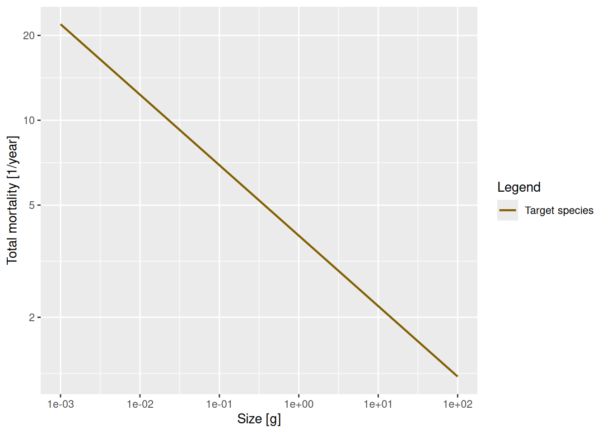
> >
> > ``` downlit
> > mm <- lm(log(mort_rate[1, ]) ~ log(w(params)))
> > mm
> > ```
> >
> >
> >     Call:
> >     lm(formula = log(mort_rate[1, ]) ~ log(w(params)))
> >
> >     Coefficients:
> >        (Intercept)  log(w(params))  
> >               1.36           -0.25  
> >
> > To get the coefficient \mu_0 for the mortality rate we need to exponentiate the intercept
> >
> > ``` downlit
> > m0 <- exp(coef(mm)[[1]])
> > m0
> > ```
> >
> >     [1] 3.896875

## Slope of juvenile spectrum

We have seen that for juvenile fish the growth rate and the death rate are both power laws with exponents p=3/4 and r=p-1=-1/4 respectively. By solving a differential equation we can derive that the juvenile spectrum also follows a power law: N(w) = N_0\\ w^{-\mu_0/g_0 - p}.

I won’t do the maths here with you (and you probably don’t want me to anyway), but we can see that the result makes sense. It tells us that the number density drops off faster with size if the mortality rate coefficient \mu_0 is higher or if the growth rate coefficient g_0 is smaller, which is what we would expect.

We can also check this claim numerically. Let’s look at the spectrum of individuals in log-log axes.

``` downlit
plot(n, log_x = TRUE, log_y = TRUE)
```

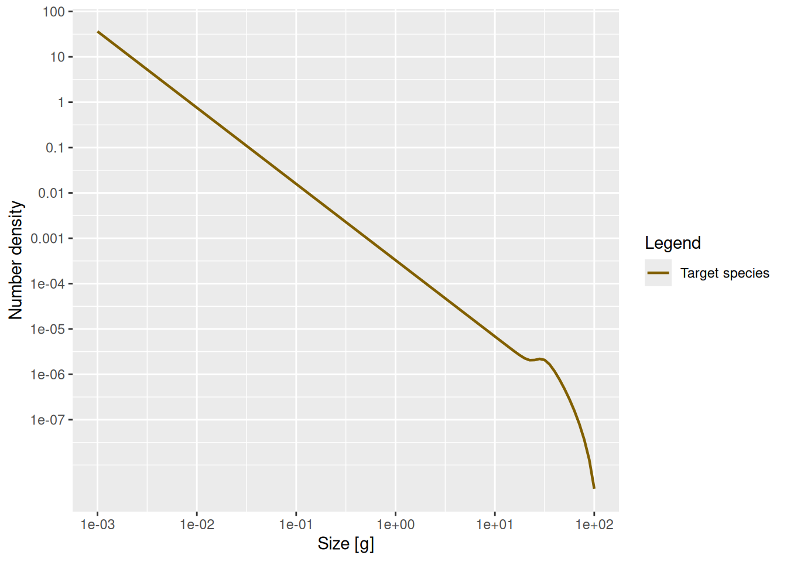

That confirms what we had seen earlier, that for fish less than 10 grams the number density is a power law. To determine the exponent of the power law we need the slope of that straight line in the log-log plot, and the easiest way to do that is to fit a linear model to the log variables:

``` downlit
n_small_fish <- n[w(params) <= 10]
lm(log(n_small_fish) ~ log(w_small_fish))
```


    Call:
    lm(formula = log(n_small_fish) ~ log(w_small_fish))

    Coefficients:
          (Intercept)  log(w_small_fish)  
               -8.022             -1.682  

The linear model fit says that the exponent is -1.682. The mathematics claimed that the exponent should be -\mu_0 / g_0 - p. We have already observed that g_0 \approx 4.2 and you have determined \mu_0 in Exercise 3, so we get

``` downlit
-m0 / g0 - 3/4
```

    [1] -1.67783

That is not quite the result of the linear model fit, but that is the nature of numerical calculations: one gets discretisation errors and rounding errors. Anyway, it is close enough. And it is also amazing how we can calculate expected numbers of fish from basic assumptions and rules. Of course, natural ecosystems never look like that, but if we have theoretical expectations derived from clear assumptions (about growth and mortality rate and food availability), we can start asking questions about which processes in natural ecosystems deviate from these generic assumptions, why this happens and how it should affect the observed size spectra.

## Shape of adult spectrum

Now that we understand the shape of the size spectrum for the juvenile fish, let us try to understand the shape of the adult spectrum. Here is the plot of the biomass density again, but with the w axis restricted to weights above 10g:

``` downlit
plotSpectra(params, wlim = c(10, NA))
```

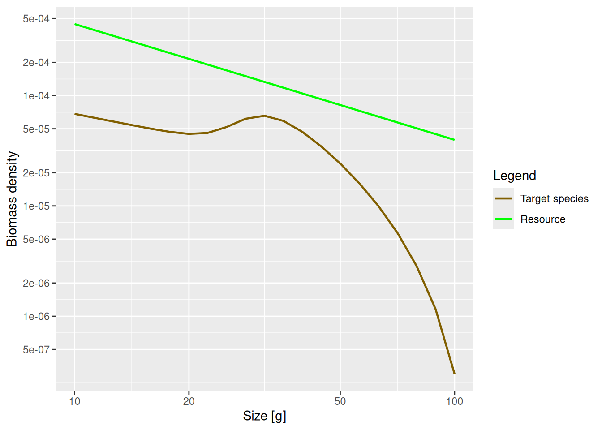

The increase of abundance that we see at around the maturity size of our species is due to a drop in growth rate at that size. This in turn is due to the fact that the mature fish invests some of its energy into reproduction instead of growth. So the details of the shape of the adult spectrum will be influenced both by food intake, maintenance and mortality (like in juveniles), but also by how adults split their energy income between growth and reproduction.

### Investment into reproduction

Let us look at a plot of the proportion \psi(w) of the available energy that is invested into reproduction as a function of the size w. This is the product of the proportion of individuals that are mature (obtained with the function [`maturity()`](https://sizespectrum.org/mizer/reference/setReproduction.html) and the proportion of their energy income that a mature fish invests into reproduction (obtained with the function [`repro_prop()`](https://sizespectrum.org/mizer/reference/setReproduction.html).

``` downlit
p <- plot(psi(params), log_x = FALSE)
p
```


How was this maturity curve specified? You can find the details in the [mizer documentation](https://sizespectrum.org/mizer/reference/setReproduction.html#investment). There are four species parameters involved:

- the maturity size `w_mat` at which 50% of the individuals are mature.
- the size `w_mat25` at which 25% of the individuals are mature.
- the size `w_repro_max` at which a typical mature individual invests 100% of its income into reproduction. (This is not a hard upper size limit: not all individuals are mature at `w_repro_max`, and diffusion in the growth process allows some to grow beyond it.)
- an exponent `m` that determines how the proportion that an individual invests into reproduction scales with its size.

Such species parameters are contained in a data frame inside the `params` object that we can access with the [`species_params()`](https://sizespectrum.org/mizer/reference/species_params.html) function.

``` downlit
species_params(params)
```

As you can see, there are a lot of other species parameters, some of which we will talk about later. For now let’s just select the 4 parameters we are interested in.

``` downlit
select(species_params(params), w_mat, w_mat25, w_repro_max, m)
```

And with this knowledge of parameters we can improve the plot for clarity and add a vertical line at 25% and 50% maturation weight

``` downlit
p + geom_vline(xintercept = species_params(params)$w_mat, lty = 2) +
    geom_vline(xintercept = species_params(params)$w_mat25, lty = 2, col = "grey")
```

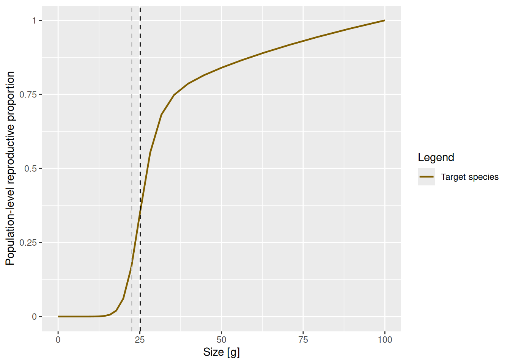

### Change in maturity curve

Let us investigate what happens when we change the maturity curve. Let’s assume the maturity size is actually 40 grams and the size at which 25% of individuals is mature is 30 grams. Let us change the values in the `species_params` data frame. But first we make a copy of the params object so that we can keep the old version around unchanged.

``` downlit
params_changed_maturity <- params
```

In this copy we now change the species parameters

``` downlit
given_species_params(params_changed_maturity)$w_mat <- 40
given_species_params(params_changed_maturity)$w_mat25 <- 30
select(species_params(params_changed_maturity), w_mat, w_mat25, w_repro_max, m)
```

Now the maturity curve has changed, which we can verify by plotting it

``` downlit
pc <- plot(psi(params_changed_maturity), log_x = FALSE) +
    geom_vline(xintercept = species_params(params_changed_maturity)$w_mat, 
               lty = 2) +
    geom_vline(xintercept = species_params(params_changed_maturity)$w_mat25, 
               lty = 2, col = "grey")
pc
```

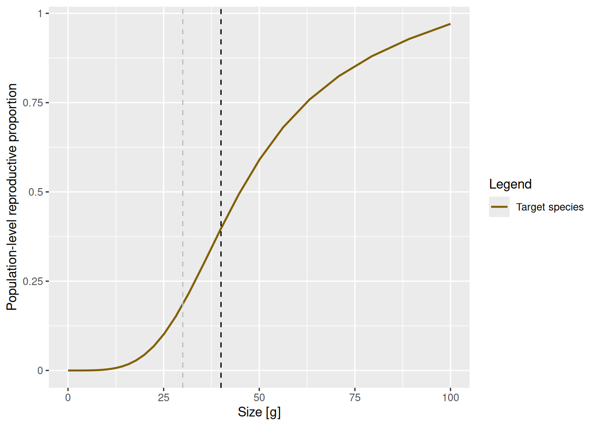

With the [`addPlot()`](https://sizespectrum.org/mizer/reference/addPlot.html) function we can add the new curve to the plot of the old curve for a quick comparison.

``` downlit
addPlot(p, psi(params_changed_maturity))
```

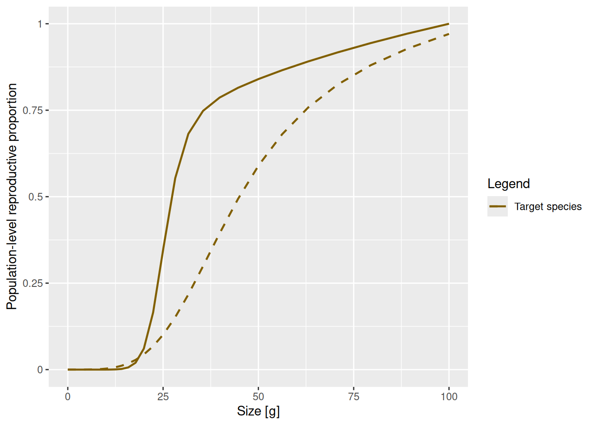

This change in the maturity curve of course implies a change in the growth rates.

> **CAUTION:**
>
> Make a plot showing the growth rates of the original model and of the model with the changed maturity curve.
>
> > **CAUTION:**
> >
> > ``` downlit
> > p <- plot(getEGrowth(params), log_x = FALSE)
> > addPlot(p, getEGrowth(params_changed_maturity))
> > ```
> >
> > 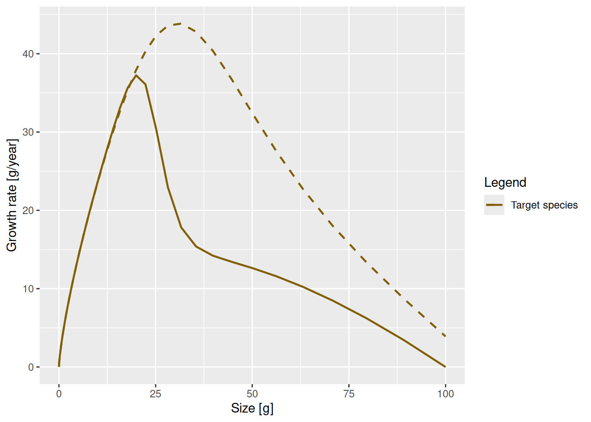

### Effect of changed maturity

Next let us look at how the change in the maturity parameters and the resulting change in the growth rate affects the steady state spectrum. First we need to calculate the new steady state using the function [`steadySingleSpecies()`](https://sizespectrum.org/mizer/reference/steadySingleSpecies.html).

``` downlit
params_changed_maturity <- steadySingleSpecies(params_changed_maturity)
```

Then we can use the function [`plotSpectra2()`](https://sizespectrum.org/mizer/reference/plotSpectra2.html) to plot the old size spectrum and the new size spectrum on the same graph.

``` downlit
plotSpectra2(params, name1 = "Early maturity",
             params_changed_maturity, name2 = "Late maturity",
             power = 2, resource = FALSE, wlim = c(10, NA))
```

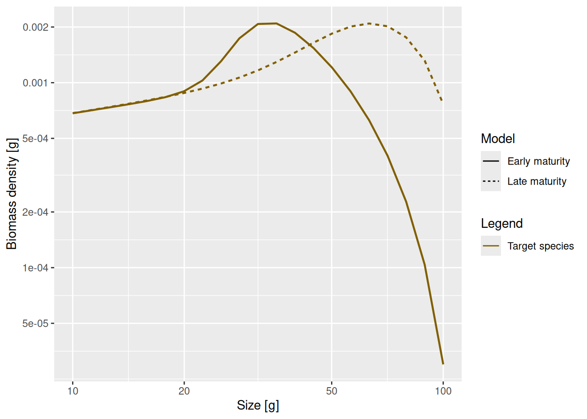

As expected, the bump happens later due to the larger maturity size and it is less steep, because the maturity curve is less steep. This means that fish do not suddenly start investing most of their energy into reproduction, but still keep growing while they are maturity. Since they are still growing they will be moving from one size class to another and fewer individuals will accumulate in one size class.

This was our first investigation of how the shape of a species size spectrum changes as model parameters are changed. We will do much more in this direction in the next tutorial in which we discuss how growth and mortality are determined through predation.

## Summary and recap

1\) The steady state is the state where the system has reached an equilibrium in which the rate at which individuals grow into each size class is equal to the rate at which individuals either grow out of the size class or die in the size class.

2\) Mizer stores the size spectrum in the form of the number density in size classes. To get the numbers in a size class we need to multiply the number density by the width of the size class (dw). To get total biomass in each size class we further multiple this value by the weight of this size class (w).

3\) Allometric scaling of physiological rates with size plays a big role in a mizer model and shapes the size spectrum.

4\) We studied a single species living in a fixed background community with a power-law spectrum. In this simple case we can determine the steady state spectrum and find that the juvenile spectrum is given by a power law whose exponent is determined by the ratio of mortality to growth and is different from the community spectrum power law.

5\) As fish mature they start investing some of their energy into reproduction and hence their growth slows. This leads to a bump in the size spectrum. We saw how changes in the parameters describing the maturity ogive change the shape of that bump.
