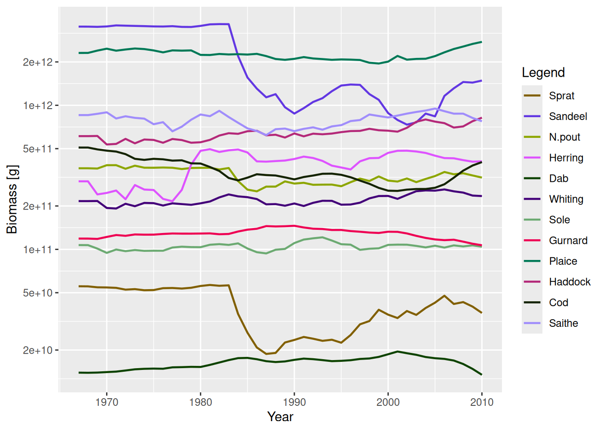
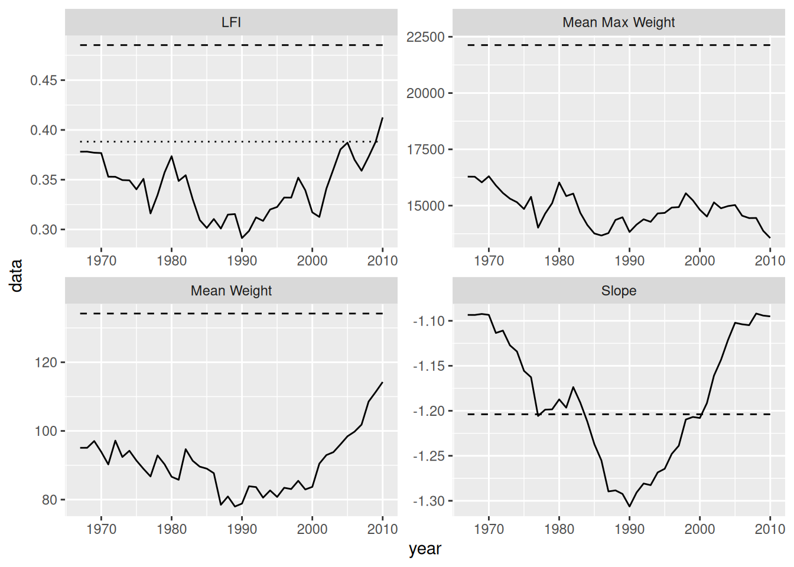
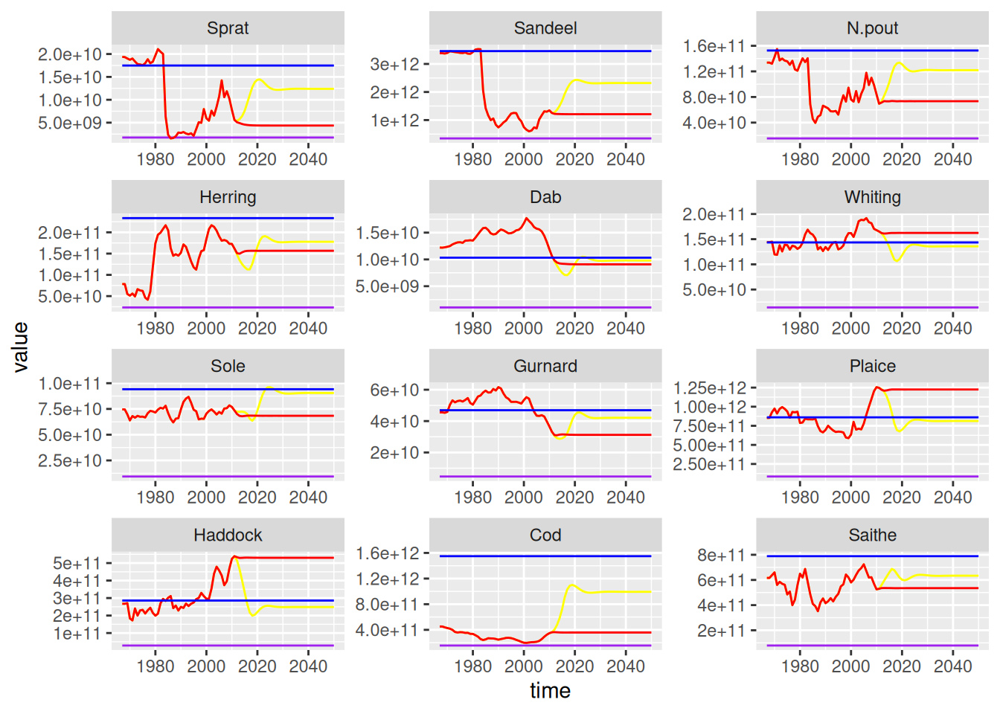

# A simulation of the North Sea

In this section we try to pull everything together with an extended example of a multispecies model for the North Sea. First we will set up the model, project it through time using historical levels of fishing effort, and then examine the results. We then run two different future projection scenarios.

## Setting up the North Sea model

The first job is to set up the `MizerParams` object for the North Sea model. In the previous multispecies examples we have already been using the life-history parameters and the interaction matrix for the North Sea model. We will use them again here but will make some changes. In particular we set up the fishing gears differently.

### Species parameters

The species in the model are: Sprat, Sandeel, N.pout, Herring, Dab, Whiting, Sole, Gurnard, Plaice, Haddock, Cod, Saithe, which account for about 90% of the total biomass of all species sampled by research trawl surveys in the North Sea. The `NS_species_params` object that comes as an example with the mizer package is a data.frame with columns for `species`, `w_max`, `w_mat`, `beta`, `sigma`, `k_vb`, `R_max` and `w_inf`.

``` downlit
NS_species_params
```

We have seen before that only having these columns in the species data.frame is sufficient to make a `MizerParams` object. Any missing columns will be filled with default values by the `MizerParams` constructor. For example, the data.frame does not include columns for `h` or `gamma`. This means that they will be estimated using the `k_vb` column.

We will use the default density dependence in the reproduction rate, which is the Beverton-Holt shape. This requires a column `R_max` in the species data.frame which contains the maximum reproduction rate for each species. This column is already in the `NS_species_params` data.frame. The values were found through a calibration process which is not covered here.

### Gear parameters

At the moment we are not providing any information on the selectivity of the gears for the species. By default, the selectivity function is a knife-edge which only takes a single argument, `knife_edge_size`. In this model we want the selectivity pattern to be a sigmoid shape which more accurately reflects the selectivity pattern of trawlers in the North Sea. The sigmoid selectivity function is expressed in terms of length rather than weight and uses the parameters `l25` and `l50`, which are the lengths at which 25% and 50% of the stock is selected. The length based sigmoid selectivity looks like:

\begin{equation} % {#eq:trawl_sel} S_l = \frac{1}{1 + \exp(S1 - S2\\ l)} \end{equation}

where l is the length of an individual, S_l is the selectivity at length, S2 = \log(3) / (l50 - l25) and S1 = l50 \cdot S2.

This selectivity function is included in mizer as `sigmoid_length()`. You can see the help page for more details. As the mizer model is weight based, and this selectivity function is length based, it uses the length-weight parameters `a` and `b` to convert between length and weight using the standard relation w = a l^b. These species parameters need to be added as columns to the `NS_species_params` data frame.

``` downlit
NS_species_params$a <- c(0.007, 0.001, 0.009, 0.002, 0.010, 0.006, 0.008, 0.004,
                      0.007, 0.005, 0.005, 0.007)
NS_species_params$b <- c(3.014, 3.320, 2.941, 3.429, 2.986, 3.080, 3.019, 3.198,
                      3.101, 3.160, 3.173, 3.075)
```

`sigmoid_length()` has the arguments `l25` and `l50`. As explained in [the section on fishing gears and selectivity](https://sizespectrum.org/mizer/articles/multispecies_model.html#sec:fishing_gear), the arguments of the selectivity function need to be in the gear parameter data frame. We also need a column specifying the name of the selectivity function we wish to use. Note it would probably be easier to put this data into a \*.csv file and then read it in rather than type it in by hand like we do here:

``` downlit
gear_params <- 
    data.frame(species = NS_species_params$species,
               gear = NS_species_params$species,
               sel_func = "sigmoid_length",
               l25 =  c(7.6, 9.8, 8.7, 10.1, 11.5, 19.8, 16.4, 19.8, 11.5,
                        19.1, 13.2, 35.3),
               l50 = c(8.1, 11.8, 12.2, 20.8, 17.0, 29.0, 25.8, 29.0, 17.0,
                       24.3, 22.9, 43.6))
gear_params
```

Note that we have set up a `gear` column so that each species will be caught by a separate gear named after the species.

In this model we are interested in projecting forward using historical fishing mortalities. The historical fishing mortality from 1967 to 2010 for each species is stored in the csv file `NS_f_history.csv` included in the package. As before, we can use [`read.csv()`](https://rdrr.io/r/utils/read.table.html) to read in the data. This reads the data in as a `data.frame`. We want this to be a `matrix` so we use the `as()` function:

``` downlit
f_location <- system.file("extdata", "NS_f_history.csv", package = "mizer")
f_history <- as(read.csv(f_location, row.names = 1), "matrix")
```

We can take a look at the first years of the data:

``` downlit
head(f_history)
```

         Sprat Sandeel N.pout   Herring        Dab   Whiting      Sole Gurnard
    1967     0       0      0 1.0360279 0.09417655 0.8294528 0.6502019       0
    1968     0       0      0 1.7344576 0.07376065 0.8008995 0.7831250       0
    1969     0       0      0 1.4345001 0.07573638 1.3168280 0.8744095       0
    1970     0       0      0 1.4342405 0.10537236 1.3473505 0.6389915       0
    1971     0       0      0 1.8234973 0.08385884 0.9741884 0.8167561       0
    1972     0       0      0 0.9033768 0.09044461 1.3148588 0.7382834       0
            Plaice   Haddock       Cod    Saithe
    1967 0.4708827 0.7428694 0.6677456 0.4725102
    1968 0.3688033 0.7084553 0.6994389 0.4270201
    1969 0.3786819 1.3302821 0.6917888 0.3844648
    1970 0.5268618 1.3670695 0.7070891 0.5987086
    1971 0.4192942 0.9173131 0.7737543 0.4827822
    1972 0.4522231 1.3279087 0.8393267 0.5796321

Fishing mortality is calculated as the product of selectivity, catchability and fishing effort. The values in `f_history` are absolute levels of fishing mortality. We have seen that the fishing mortality in the `mizer` simulations is driven by the fishing effort argument passed to the `project()` function. Therefore if we want to project forward with historical fishing levels, we need to provide `project()` with effort values that will result in these historical fishing mortality levels.

One of the model parameters that we have not really considered so far is `catchability`. Catchability is a scalar parameter used to modify the fishing mortality at size given the selectivity at size and effort of the fishing gear. By default catchability has a value of 1, meaning that an effort of 1 results in a fishing mortality of 1 for a fully selected species. When considering the historical fishing mortality, one option is therefore to leave catchability at 1 for each species and then use the `f_history` matrix as the fishing effort. However, an alternative method is to use the effort relative to a chosen reference year. This can make the effort levels used in the model more meaningful. Here we use the year 1990 as the reference year. If we set the catchability of each species to be the same as the fishing mortality in 1990 then an effort of 1 in 1990 will result in the fishing mortality being what it was in 1990. The effort in the other years will be relative to the effort in 1990.

``` downlit
gear_params$catchability <- as.numeric(f_history["1990", ])
```

### Other parameters

Considering the other model parameters, we will use default values for all of the other parameters apart from `kappa`, the carrying capacity of the resource spectrum (see [see the section on resource density](https://sizespectrum.org/mizer/articles/model_description.html#resource-density)). This was estimated along with the values `R_max` as part of the calibration process.

We will use the interaction matrix `inter` that is shipped as an example with the mizer package, see also (https://sizespectrum.org/mizer/articles/multispecies_model.html#setting-the-interaction-matrix).

We now have all the information we need to create the `MizerParams` object:

``` downlit
params <- newMultispeciesParams(NS_species_params, 
                                interaction = inter, 
                                kappa = 9.27e10,
                                gear_params = gear_params)
```

    Because you have n != p, the default value for `h` is not very good.
    Because the age at maturity is not known, I need to fall back to using
    von Bertalanffy parameters, where available, and this is not reliable.
    No ks column so calculating from critical feeding level.
    Using z0 = z0pre * w_max ^ z0exp for missing z0 values.
    Using f0, h, lambda, kappa and the predation kernel to calculate gamma.

## Setting up and running the simulation

As we set our catchability to be the level of fishing mortality in 1990, before we can run the projection we need to rescale the effort matrix to get a matrix of efforts relative to 1990. To do this we want to rescale the `f_history` object to 1990 so that the relative fishing effort in 1990 = 1. This is done using R function [`sweep()`](https://rdrr.io/r/base/sweep.html). We then check a few rows of the effort matrix to check this has happened:

``` downlit
relative_effort <- sweep(f_history, 2, f_history["1990", ], "/")
relative_effort[as.character(1988:1992), ]
```

             Sprat   Sandeel    N.pout  Herring      Dab   Whiting      Sole
    1988 0.8953804 1.2633229 0.8953804 1.214900 1.176678 0.9972560 1.2786517
    1989 1.1046196 1.2931034 1.1046196 1.232790 1.074205 0.8797926 0.9910112
    1990 1.0000000 1.0000000 1.0000000 1.000000 1.000000 1.0000000 1.0000000
    1991 1.1902174 0.8814002 1.1902174 1.108016 1.143110 0.8096927 1.0044944
    1992 1.2500000 0.8500522 1.2500000 1.316576 1.113074 0.7718676 0.9505618
           Gurnard   Plaice   Haddock      Cod    Saithe
    1988 0.0000000 1.176678 0.9946140 1.045964 1.0330579
    1989 0.0000000 1.074205 0.8545781 1.060538 1.1223140
    1990 1.0000000 1.000000 1.0000000 1.000000 1.0000000
    1991 0.8096927 1.143110 0.7971275 1.001121 0.9619835
    1992 0.7718676 1.113074 0.8797127 0.970852 1.0528926

We could just project forward with these relative efforts. However, the population dynamics in the early years will be strongly determined by the initial population abundances (known as the transient behaviour - essentially the initial behaviour before the long term dynamics are reached). As this is ecology, we don’t know what the initial abundance are. One way around this is to project forward at a constant fishing mortality equal to the mortality in the first historical year until equilibrium is reached. We then use this steady state as the initial state for the simulation. This approach reduces the impact of transient dynamics.

``` downlit
params <- projectToSteady(params, effort = relative_effort["1967", ])
```

    Convergence was achieved in 24 years.

We now have our parameter object and out matrix of efforts relative to 1990. We use this effort matrix as the `effort` argument to the `project()` function. We use `dt` = 0.25 (the simulation will run faster than with the default value of 0.1, but tests show that the results are still stable) and save the results every year.

``` downlit
sim <- project(params, effort = relative_effort, dt = 0.25, t_save = 1)
```

Plotting the results, we can see how the biomasses of the stocks change over time.

``` downlit
plotBiomass(sim)
```



To explore the state of the community it is useful to calculate indicators of the unexploited community. Therefore we also project forward to the steady state with 0 fishing effort.

``` downlit
sim0 <- projectToSteady(params, effort = 0, return_sim = TRUE)
```

    Convergence was achieved in 42 years.

## Exploring the model outputs

Here we look at some of the ways the results of the simulation can be explored. We calculate the community indicators `mean maximum weight`, `mean individual weight`, `community slope` and the `large fish indicator` (LFI) over the simulation period, and compare them to the unexploited values. We also compare the simulated values of the LFI to a community target based on achieving a high proportion of the unexploited value of the LFI of 0.8 LFI\_{F=0}.

The indicators are calculated using the functions described in [the section about indicator functions](../use/exploring_the_simulation_results.llms.md#functions-for-calculating-indicators). Here we calculate the LFI and the other community indicators for the unexploited community. When calculating these indicators we only include demersal species and individuals in the size range 10 g to 100 kg, and the LFI is based on species larger than 40 cm. Each of these functions returns a time series. We are interested only in the equilibrium unexploited values so we just select the final time step.

``` downlit
demersal_species <- c("Dab", "Whiting", "Sole", "Gurnard", "Plaice",
                      "Haddock", "Cod", "Saithe")
final <- idxFinalT(sim0)
lfi0 <- getProportionOfLargeFish(sim0, species = demersal_species,
                                 min_w = 10, max_w = 100e3, 
                                 threshold_l = 40)[[final]]
mw0 <- getMeanWeight(sim0, species = demersal_species,
                     min_w = 10, max_w = 100e3)[[final]]
mmw0 <- getMeanMaxWeight(sim0, species = demersal_species,
                         min_w = 10, max_w = 100e3)[final, "mmw_biomass"]
slope0 <- getCommunitySlope(sim0, species = demersal_species,
                            min_w = 10, max_w = 100e3)[final, "slope"]
```

We also calculate the time series of these indicators for the exploited community:

``` downlit
lfi <- getProportionOfLargeFish(sim, species = demersal_species,
                                min_w = 10, max_w = 100e3, 
                                threshold_l = 40)
mw <- getMeanWeight(sim, species = demersal_species,
                    min_w = 10, max_w = 100e3)
mmw <- getMeanMaxWeight(sim, species = demersal_species, min_w = 10,
                        max_w = 100e3)[, "mmw_biomass"]
slope <- getCommunitySlope(sim, species = demersal_species, min_w = 10,
                           max_w = 100e3)[, "slope"]
```

We can plot the exploited and unexploited indicators, along LFI reference level. Here we do it using `ggplot2` which uses data.frames. We make three data.frames (one for the time series, one for the unexploited levels and one for the reference level): Each data.frame is a data.frame of each of the measures, stacked on top of each other.

``` downlit
library(ggplot2)
years <- 1967:2010
# Simulated data
community_plot_data <- rbind(
    data.frame(year = years, measure = "LFI", data = lfi),
    data.frame(year = years, measure = "Mean Weight", data = mw),
    data.frame(year = years, measure = "Mean Max Weight", data = mmw),
    data.frame(year = years, measure = "Slope", data = slope))
# Unexploited data
community_unfished_data <- rbind(
    data.frame(year = years, measure = "LFI", data = lfi0),
    data.frame(year = years, measure = "Mean Weight", data = mw0),
    data.frame(year = years, measure = "Mean Max Weight", data = mmw0),
    data.frame(year = years, measure = "Slope", data = slope0))
# Reference level
community_reference_level <-
    data.frame(year = years, measure = "LFI", data = lfi0 * 0.8)
# Build up the plot
ggplot(community_plot_data) + 
    geom_line(aes(x = year, y = data)) +
    facet_wrap(~measure, scales = "free") + 
    geom_line(aes(x = year, y = data), linetype = "dashed",
              data = community_unfished_data) +
    geom_line(aes(x = year, y = data), linetype = "dotted",
              data = community_reference_level)
```



Historical (solid) and unexploited (dashed) and reference (dotted) community indicators for the North Sea multispecies model.

According to our simulations, historically the LFI in the North Sea has been below the reference level.

## Future projections

As well as investigating the historical simulations, we can run projections into the future. Here we run two projections to 2050 with different fishing scenarios.

- Continue fishing at 2010 levels (the status quo scenario).
- From 2010 to 2015 linearly change the fishing mortality to approach F\_{MSY} and then continue at F\_{MSY} until 2050.

Rather than looking at community indicators here, we will calculate the SSB of each species in the model and compare the projected levels to a biodiversity target based on the reference point 0.1 SSB\_{F=0}.

Before we can run the simulations, we need to set up arrays of future effort. We will continue to use effort relative to the level in 1990. Here we build on our existing array of relative effort to make an array for the first scenario. Note the use of the [`t()`](https://rdrr.io/r/base/t.html) command to transpose the array. This is needed because R recycles by rows, so we need to build the array with the dimensions rotated to start with. We make an array of the future effort, and then bind it underneath the `relative_effort` array used in the previous section.

``` downlit
scenario1 <- t(array(relative_effort["2010", ], dim = c(12, 40),
    dimnames = list(NULL, year = 2011:2050)))
scenario1 <- rbind(relative_effort, scenario1)
```

The relative effort array for the second scenario is more complicated to make and requires a little bit of R gymnastics (it might be easier for you to prepare this in a spreadsheet and read it in). For this one we need values of F\_{MSY}.

``` downlit
fmsy <- c(Sprat = 0.2, Sandeel = 0.2, N.pout = 0.2, Herring = 0.25, Dab = 0.2,
    Whiting = 0.2, Sole = 0.22, Gurnard = 0.2, Plaice = 0.25, Haddock = 0.3,
    Cod = 0.19, Saithe = 0.3)
scenario2 <- t(array(fmsy, dim = c(12, 40), 
                     dimnames = list(NULL, year = 2011:2050)))
scenario2 <- rbind(relative_effort, scenario2)
for (sp in dimnames(scenario2)[[2]]) {
    scenario2[as.character(2011:2015), sp] <- scenario2["2010", sp] +
        (((scenario2["2015", sp] - scenario2["2010", sp]) / 5) * 1:5)
}
```

We are now ready to project the two scenarios.

``` downlit
sim1 <- project(params, effort = scenario1, dt = 0.25)
sim2 <- project(params, effort = scenario2, dt = 0.25)
```

We can now compare the projected SSB values in both scenarios to the biodiversity reference points. First we calculate the biodiversity reference points (from the final time step in the unexploited `sim0` simulation):

``` downlit
ssb0 <- getSSB(sim0)[final, ]
```

Now we build a data.frame of the projected SSB for each species. We make use of the `melt()` function to transform arrays into data frames.

``` downlit
years <- 1967:2050
ssb1_df <- melt(getSSB(sim1))
ssb2_df <- melt(getSSB(sim2))
ssb_df <- rbind(
    cbind(ssb1_df, scenario = "Status quo"),
    cbind(ssb2_df, scenario = "Fmsy"))
ssb_unexploited_df <- cbind(expand.grid(
    sp = names(ssb0),
    time = 1967:2050),
    value = as.numeric(ssb0),
    scenario = "Unexploited")
ssb_reference_df <- cbind(expand.grid(
    sp = names(ssb0),
    time = 1967:2050),
    value = as.numeric(ssb0 * 0.1),
    scenario = "Reference")
ssb_all_df <- rbind(ssb_df, ssb_unexploited_df, ssb_reference_df)
colours <- c("Status quo" = "red", "Fmsy" = "yellow",
             "Unexploited" = "blue", "Reference" = "purple")
ggplot(ssb_all_df) +
    geom_line(aes(x = time, y = value, colour = scenario)) +
    facet_wrap(~sp, scales = "free", nrow = 4) +
    theme(legend.position = "none") +
    scale_colour_manual(values = colours)
```



Historical and projected SSB under two fishing scenarios. Status quo (red), Fmsy (yellow). Unexploited (blue) and reference levels (purple) are also shown.
