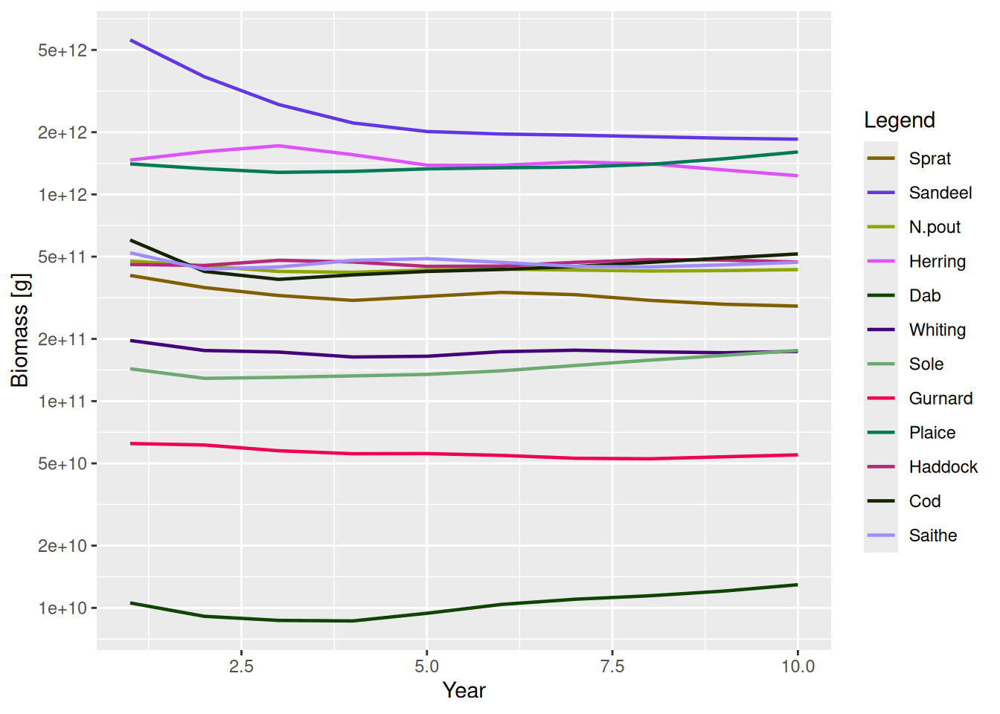
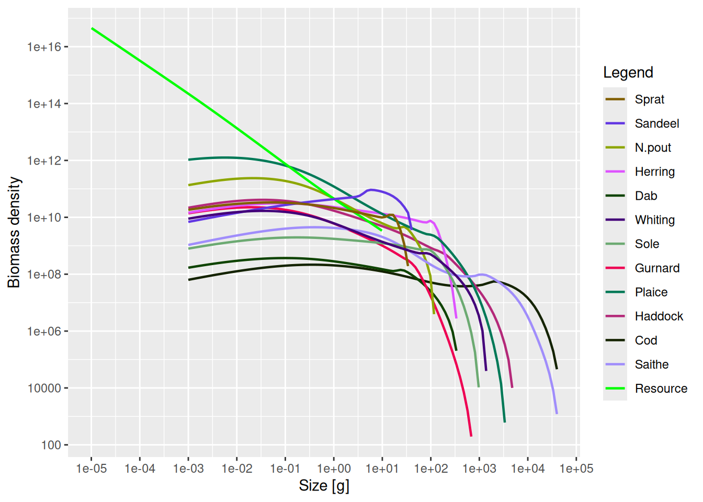
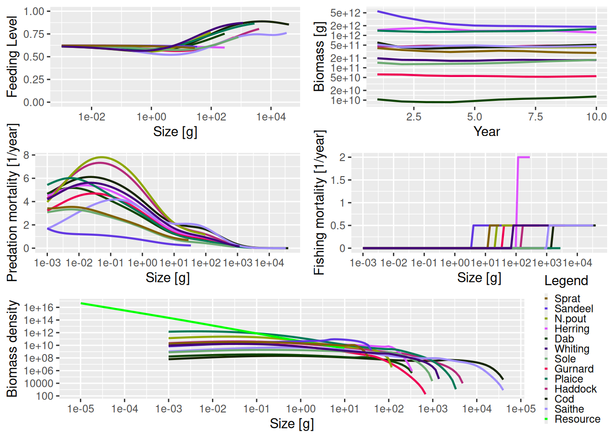

# Explore the simulation results

## Introduction

In the sections on [running a simulation](../use/running_a_simulation.llms.md) we saw how to set up a model and project it forward through time under our desired fishing scenario. The result of running a projection is an object of class `MizerSim`. What do we then do? How can we explore the results of the simulation? In this tutorial we introduce a range of summaries, plots and indicators that can be easily produced using functions included in mizer.

We will use the following `MizerSim` object for these examples, where the effort array is the one we created in the [previous section on running a simulation](../use/running_a_simulation.llms.md):

``` downlit
sim <- project(NS_params, effort = effort_array, dt = 0.1, t_save = 1)
```

## Accessing the simulation results

The projected species abundances at size through time can be obtained with `N(sim)`. This returns a three-dimensional array (time x species x size). Consequently, this array can get very big so inspecting it can be difficult. In the example we have just run, the time dimension of `n` has 10 rows (one for the initial population and then one for each of the saved time steps). There are also 12 species each with 100 sizes. We can check this by running the [`dim()`](https://rdrr.io/r/base/dim.html) function and looking at the dimensions of the `n` array:

``` downlit
dim(N(sim))
```

    [1]  10  12 100

To pull out the abundances of a particular species through time at size you can subset the array. For example to look at Cod through time you can use:

``` downlit
N(sim)[, "Cod", ]
```

This returns a two-dimensional array: time x size, containing the cod abundances. The time dimension depends on the value of the argument `t_save` when `project()` was run. You can see that even though we specified `dt` to be 0.1 when we called `project()`, the `t_save = 1` argument has meant that the output is only saved every year.

Often we are particularly interested in the results at the final time-step. These we can access with

``` downlit
finalN(sim)
```

which is a two dimensional array (species x size).

The projected resource abundances can be accesses similarly with

``` downlit
NResource(sim)
```

This returns a two-dimensional array (time x size). And if we are only interested in the final time step

``` downlit
finalNResource(sim)
```

returns a vector with one entry for each size class.

## Summary functions

As well as the [`summary()`](https://rdrr.io/r/base/summary.html) methods that are available for both `MizerParams` and `MizerSim` objects, there are other useful summary functions to pull information out of a `MizerSim` object. A description of the different summary functions available is given in [the summary functions help page.](https://sizespectrum.org/mizer/reference/summary_functions.html)

All of these functions have help files to explain how they are used. (It is also possible to use most of these functions with a `MizerParams` object if you also supply the population abundance as an argument. This can be useful for exploring how changes in parameter value or abundance can affect summary statistics and indicators. We won’t explore this here but you can see their help files for more details.)

The functions `getBiomass()` and `getN()` have additional arguments that allow the user to set the size range over which to calculate the summary statistic. This is done by passing in a combination of the arguments `min_l`, `min_w`, `max_l` and `max_w` for the minimum and maximum length or weight. If `min_l` is specified there is no need to specify `min_w` and so on. However, if a length is specified (minimum or maximum) then it is necessary for the species parameter data.frame (see [the species parameters section](https://sizespectrum.org/mizer/articles/multispecies_model.html#sec:species_parameters_dataframe)) to include the parameters `a` and `b` for length-weight conversion. It is possible to mix length and weight constraints, e.g. by supplying a minimum weight and a maximum length. The default values are the minimum and maximum weights of the spectrum, i.e. the full range of the size spectrum is used.

### Examples of using the summary functions

Here we show a simple demonstration of using a summary function using the `sim` object we created earlier. Here, we use `getSSB()` to calculate the SSB of each species through time (note the use of the [`head()`](https://rdrr.io/r/utils/head.html) function to only display the first few rows).

``` downlit
ssb <- getSSB(sim)
dim(ssb)
```

    [1] 10 12

``` downlit
head(ssb)
```

    Spawning stock biomass (6 times x 12 species) [g] 
      Sprat: min=1.14e+11 mean=1.44e+11 max=2.11e+11
      Sandeel: min=1.74e+12 mean=2.82e+12 max=5.38e+12
      N.pout: min=1.1e+11 mean=1.37e+11 max=1.83e+11
      Herring: min=3.51e+11 mean=4.81e+11 max=6.04e+11
      Dab: min=4.88e+09 mean=5.58e+09 max=6.89e+09
      Whiting: min=7.71e+10 mean=8.97e+10 max=1.14e+11
      Sole: min=4.54e+10 mean=5.26e+10 max=6.36e+10
      Gurnard: min=5.4e+09 mean=6.98e+09 max=9.1e+09
      Plaice: min=2.33e+11 mean=2.67e+11 max=3.03e+11
      Haddock: min=1.18e+11 mean=1.39e+11 max=1.59e+11
      Cod: min=2.9e+11 mean=3.6e+11 max=5.32e+11
      Saithe: min=1.98e+11 mean=2.55e+11 max=3.28e+11

As mentioned above, we can specify the size range for the `getsummaryBiomass()` and `getN()` functions. For example, here we calculate the total biomass of each species but only include individuals that are larger than 10 g and smaller than 1000 g.

``` downlit
biomass <- getBiomass(sim, min_w = 10, max_w = 1000)
head(biomass)
```

    Biomass (6 times x 12 species) [g] 
      Sprat: min=1.44e+11 mean=1.76e+11 max=2.44e+11
      Sandeel: min=1.1e+12 mean=2.18e+12 max=4.59e+12
      N.pout: min=1.67e+11 mean=1.96e+11 max=2.39e+11
      Herring: min=1.18e+12 mean=1.32e+12 max=1.54e+12
      Dab: min=6.29e+09 mean=7.13e+09 max=8.37e+09
      Whiting: min=1.27e+11 mean=1.39e+11 max=1.62e+11
      Sole: min=1.12e+11 mean=1.18e+11 max=1.27e+11
      Gurnard: min=1.91e+10 mean=2.22e+10 max=2.48e+10
      Plaice: min=6.62e+11 mean=7.12e+11 max=7.66e+11
      Haddock: min=3.23e+11 mean=3.41e+11 max=3.73e+11
      Cod: min=4.52e+10 mean=5.35e+10 max=6.29e+10
      Saithe: min=1.39e+11 mean=1.81e+11 max=2.16e+11

## Functions for calculating indicators

Functions are available to calculate a range of indicators from a `MizerSim` object after a projection. A description of the different indicator functions available is given in [the indicator functions help page.](https://sizespectrum.org/mizer/reference/indicator_functions.html). You can read the help pages for each of the functions for full instructions on how to use them, along with examples.

With all of the functions in the table it is possible to specify the size range of the community to be used in the calculation (e.g. to exclude very small or very large individuals) so that the calculated metrics can be compared to empirical data. This is used in the same way that we saw with the function `getBiomass()` in [the section on summary functions for MizerSim objects.](../use/exploring_the_simulation_results.llms.md#sec:summaries). It is also possible to specify which species to include in the calculation. See the help files for more details.

### Examples of calculating indicators

For these examples we use the `sim` object we created earlier.

The slope of the community can be calculated using the `getCommunitySlope()` function. Initially we include all species and all sizes in the calculation (only the first five rows are shown):

``` downlit
slope <- getCommunitySlope(sim)
head(slope)
```

This gives the slope, intercept and R^2 value through time (see the help file for `getCommunitySlope` for more details).

We can include only the species we want with the `species` argument. Below we only include demersal species. We also restrict the size range of the community that is used in the calculation to between 10 g and 5 kg. The `species` argument is a character vector of the names of the species that we want to include in the calculation.

``` downlit
dem_species <- c("Dab", "Whiting", "Sole", "Gurnard", "Plaice", "Haddock",
    "Cod", "Saithe")
slope <- getCommunitySlope(sim, min_w = 10, max_w = 5000, 
    species = dem_species)
head(slope)
```

## Plotting the results

R is very powerful when it comes to exploring data through plots. Two useful packages for plotting are `ggplot2` and `plotly`. These use data.frames for input data whereas many of the mizer functions return arrays or matrices. Fortunately it is straightforward to turn arrays and matrices into data.frames using the `melt()` function from the `reshape2` package that mizer makes available to you. Although `mizer` does include some dedicated plots, it is definitely worth your time getting to grips with these other plotting packages. This will make it possible for you to make your own plots.

Included in `mizer` are several dedicated plots that use `MizerSim` objects as inputs (see [the plots help page.](https://sizespectrum.org/mizer/reference/plotting_functions.html)). As well as displaying the plots, these functions all return objects of type `ggplot` from the `ggplot2` package, meaning that they can be further modified by the user (e.g. by changing the plotting theme). See the help page of the individual plot functions for more details. The generic [`plot()`](https://rdrr.io/r/graphics/plot.default.html) method has also been overloaded for `MizerSim` objects. This produces several plots in the same window to provide a snapshot of the results of the simulation.

Some of the plots plot values by size (for example `plotFeedingLevel()` and `plotSpectra()`). For these plots, the default is to use the data at the final time step of the projection. With these plotting functions, it is also possible to specify a different time, or a time range to average the values over before plotting.

### Plotting examples

Using the plotting functions is straightforward. For example, to plot the total biomass of each species against time you use the `plotBiomass()` function:

``` downlit
plotBiomass(sim)
```



As mentioned above, some of the plot functions plot values against size at a point in time (or averaged over a time period). For these plots it is possible to specify the time step to plot, or the time period to average the values over. The default is to use the final time step. Here we plot the abundance spectra (biomass), averaged over time = 5 to 10:

``` downlit
plotSpectra(sim, time_range = 5:10)
```



As mentioned above, and as we have seen several times in this guide, the generic [`plot()`](https://rdrr.io/r/graphics/plot.default.html) method has also been overloaded. This produces 5 plots in the same window (`plotFeedingLevel()`, `plotBiomass()`, `plotPredMort()`, `plotFMort()` and `plotSpectra()`). It is possible to pass in the same arguments that these individual plots use, e.g. arguments to change the time period over which the data is averaged.

``` downlit
plot(sim)
```



The next section describes how to use what we have learned to [model the North Sea.](../use/a_multispecies_model_of_the_north_sea.llms.md)
